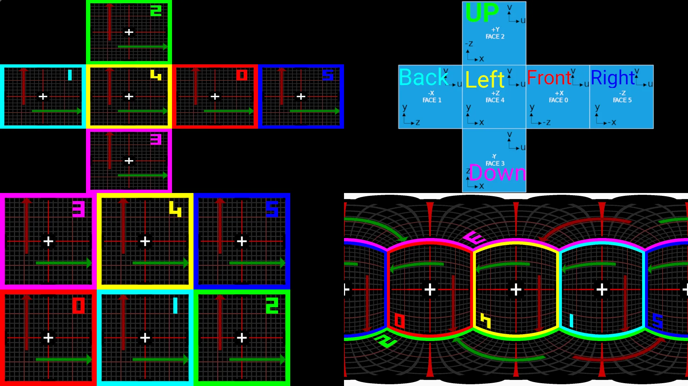
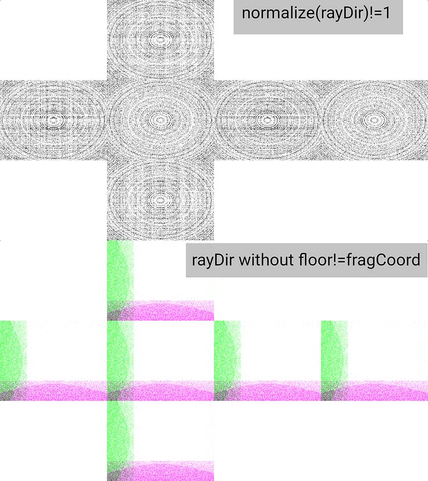

Cubemap GLSL shader debug functions
===================================

Top right [Wikipedia Cube Mapping order](https://en.wikipedia.org/wiki/Cube_mapping), top left my Cubemap, bottom left cubemap in buffer, bottom right panorama.

Shader <https://www.shadertoy.com/view/NttGWr>
----------------------------------------------

In this shader:

-   Image shader --- display Cubemap buffer, or BufA Cubemap in buffer, or BufB Cubemap as panorama (Equirectangular projection). Change `#define USE_METHOD 0` (to 1--2--3) to change displaying image.
-   BufA --- Cubemap emulation in single buffer.
-   BufB --- panorama or Equirectangular projection.
-   CubeA --- Shadertoy Cubemap.

Functions:
==========

Panorama functions:
-------------------

`panorama_screen_uv_to_rd` generate panorama *rayDir* from *uv*.\
`panorama_rd_to_pan_uv` reverse operation return *uv* of panorama texture from *rayDir*.

Cubemap functions:
------------------

`convert_xyz_to_cube_uv` convert *rayDir* to cubemap face *uv*, return *index* of face and *uv*.\
`convert_cube_uv_to_xyz` reverse function convert face *index* and *uv* to *rayDir*.

Cubemap emulation functions:
----------------------------

`buffer_cubemap_rd` return *rd*, cube side *fragCoord* and cube side *index* and *size* from buffer *fragCoord* and buffer size(pixels, *iResolution* on shadertoy).\
`texture_buffer_cubemap` direct replacement for *texture* function to read cubemap in buffer same as Cubemap texture.

Other functions:
----------------

`getCubeMap` - display Cubemap as 6 square textures.

How it can be used:
===================

1.  Using `panorama_screen_uv_to_rd`-> `convert_xyz_to_cube_uv` result will be fragCoord for Panorama Equirectangular projection. (look *BufB*)
2.  Using `getCubeMap`-> `panorama_rd_to_pan_uv` result is Panorama can be displayed as 6 Cube sides. (look `#elif USE_METHOD==2` in *Image*)
3.  Function `convert_xyz_to_cube_uv` can be used to construct Cubemap from 6 separated textures, input is *rayDir* and to switch texture 1-6 use returned *index* of cube side, and *cube side uv* as texture *uv*.
4.  In Image shader function `rd_to_screen_uv` to select Screen on Cubemap preview (in my shader red rectangle on Cubemap preview show where camera look)
5.  Cubemap emulation --- I made it to debug [this shader](https://www.shadertoy.com/view/st33z7), cubemap emulation to 2D buffer surface.\
    I made [*this Vulkan application*](https://danilw.github.io/GLSL-howto/vulkan_sh_launcher/template_cube_bin.zip) with *1024* pixels cube side size (same as on Shadertoy), *3072x2048* buffer size, I use it to debug.

Top is [normalize bug](https://www.shadertoy.com/view/7lt3Rl), bot is [rayDir vs fragCoord](https://www.shadertoy.com/view/7l33W2).

Bugs:
=====

-   When `rayDir` used to generate *2D *`fragCoord` remember to do `floor` of generated fragCoord and add 0.5, because fragCoord generated this way does not point to the center of the pixel. (look line 8 in CubeA in this [example shader](https://www.shadertoy.com/view/7l33W2))
-   Do not expect `length(normalize(rayDir))`- to be equal 1. [Example shader](https://www.shadertoy.com/view/7lt3Rl).
-   Length of `rayDir` can be equal to `0.` it will ruin`normalize`. Add `+0.0001` to rayDir before normalize or check length of rayDir.
-   Do not use function *texture()* to read *samplerCube* or *sampler2D* if you need "some values", texture use mipmap levels (even when mipmaps not generated) to calculate value that lead to +-0.05 error in read value.\
    Use *textureLod* or *texelFetch*.\
    [Example shader](https://www.shadertoy.com/view/sltGWj) with this bug, works in Vulkan and OpenGL.

Thanks for reading.
