Games in the GPU shaders
========================

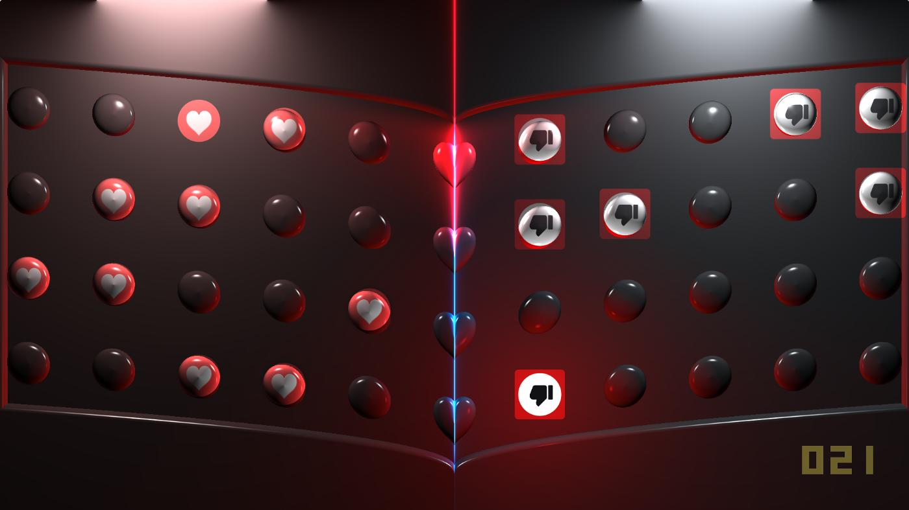

Screenshot from <https://www.shadertoy.com/view/3syXDD>

**This is not a tutorial**, I write only about my way of creating logic and some useful tips and code.

Useful Shaders and Shadertoy related links and tips in my [previous blog post](https://arugl.medium.com/into-shadertoy-and-shaders-useful-links-and-tips-7f3e2f192275).

**Content:**

1.  Useful code for data saving/loading.
2.  2D drawing/creating graphics.
3.  Optimization and debugging.
4.  The edge of the Games in GPU.
5.  Links to my own games in the shaders.
6.  Export template.

How it works:
=============

Shadertoy implementation of "buffer logic" allows read from "buffer previous frame data"(BufferA read self when *binded* as one of *iChannels*).

Basic logic ---in the buffer on Frame 0 init data and on next frames execute game logic reading the previous state of saved data.

And Image buffer displays the state of logic using game elements and UI.

Creating a game in the GLSL shader is the same as in pure C --- the result is very large linear straightforward logic.

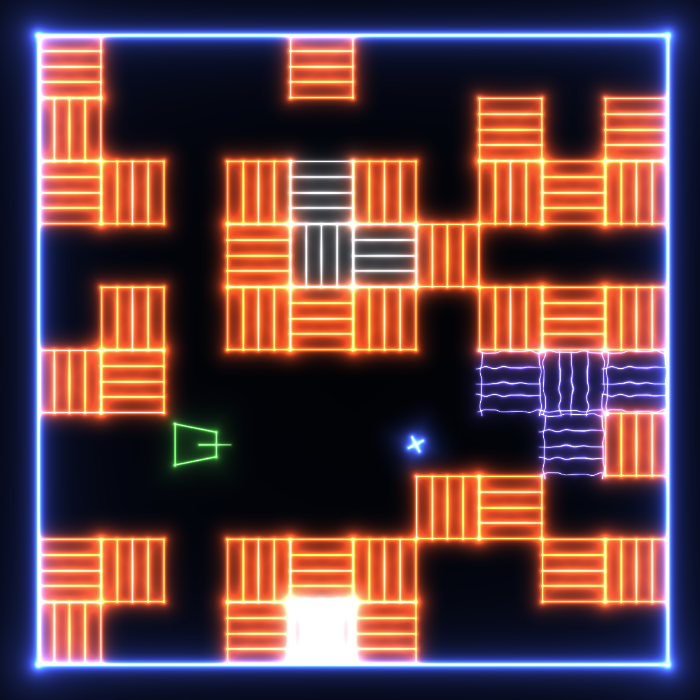

Example of the game in the shaders <https://www.shadertoy.com/view/wdS3D3>

**[This example](https://www.shadertoy.com/view/wdS3D3) shows how I use 28 pixels to save data** (state of map and logic).

Pixels, each pixel is v*ec4(r,g,b,a)*:\
0 --- init game status\
1 to 26 --- used to store 10x10 map, *25 pixels*4(r,g,b,a) *values=100*\
27 --- (r,g) player position, (b) direction of player rotation, (a) time of start movement\
28 --- (r,g) bullet position, (b) direction of player rotation when bulled launched, (a) time of bullet launch

*Player and bullet position is tile index* where they located now.\
Timers are used to move player or bullet to the next tile by direction.\
And Image shader animate movement using timer value.

*In the tiles stored ID of the tile*(water/block/free/etc), and Image shader draw graphics base on tile ID.\
I use the whole 32-bit value to save a single tile ID, in real use single tile can contain much more information than just a tile ID, and for that case, the unused part of 32-bit data can be used. Look below for functions to store data.

Useful code for data saving/loading:
====================================

To read pixel data always use ***texelFetch***.

**Shadertoy Buffers is GL_RGBA32F** 32 bit per value, 128 bits of data can be saved per "thread"(pixel).\
GLSL has functions ***floatBitsToUint*** and ***uintBitsToFloat*** conversion *float32 *from/to* uint32*. Large *32bit uint* can be stored in a single float.

To optimize data --- use and save more than 4 values per pixel(thread).\
[**These functions**](https://www.shadertoy.com/view/Nls3Rn) can be used:

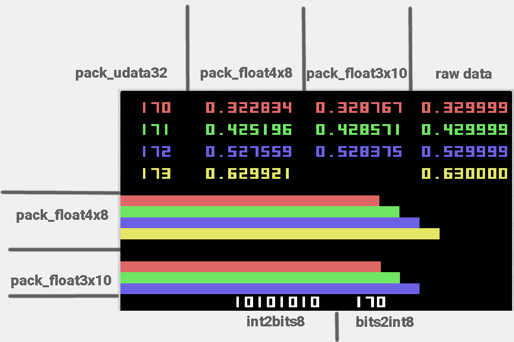

[https://www.shadertoy.com/view/Nls3Rn](https://www.shadertoy.com/view/Nls3Rn#)

Description:
------------

**uint** in 0--255 range\
**float** in -1.0 to 1.0 range

**_udata32** is pack/unpack four 8-bit uint to/from 32 bit\
[0xF1][0xF2][0xF3][0xF4] to/from 0xF1F2F3F4\
**_float4x8** is four 8-bit floats\
**_float3x10** is three 10-bit floats\
**bits** is 8-bit int in range 0--255 presented as bits

Usage :
-------

**When game logic needs a large number of *booleans *to switch states** --- data to save/load can be presented as bits that allow saving 32-booleans per value and 128 booleans per pixel.

Same with other types of data, when *integers* don't need a full 32-bit range they can be packed to a smaller range, same with *floats* as for example timers-like better to store at least in the 10 bits (because 8-bit has a way too large step that noticeable in smooth-movement that you can see on the preview shader).

2D drawing/creating graphics:
=============================

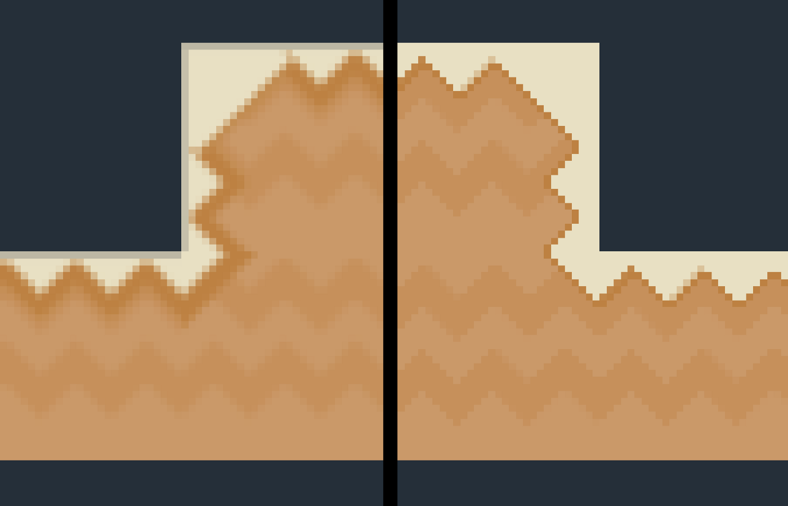

Left SDF antialiasing. On the right no antialiasing. <https://www.shadertoy.com/view/ll3BzM>
Look this shader also, TAA examples <https://www.shadertoy.com/view/sljyRy>

Antialiasing:
-------------

1.  With **hardware derivatives**:\
    [Filterable procedurals](https://iquilezles.org/www/articles/filterableprocedurals/filterableprocedurals.htm) --- square patterns.\
    Nonsquare ---[ concentric rings](https://www.shadertoy.com/view/WsX3Rl) and [isovalues](https://www.shadertoy.com/view/MdfcRS). More information on the [Shadertoy Unofficial](https://shadertoyunofficial.wordpress.com/).\
    Another way can be --- *move procedural pattern to its own buffer(BufA) and generate mipmaps* for it every frame, and use *texture* function in the main buffer to create graphics using generated texture from a buffer.
2.  With **SDF**:\
    `float px = 1./iResolution.y;`\
    `float edge = smoothstep(0., px, sdf);`\
    [Example displayed on the screenshot](https://www.shadertoy.com/view/ll3BzM).
3.  **Multisampling**:\
    Call pixel function many times with shifting pixel position in range of a half pixel. **This is very slow**, better do not use it in real-time.\
    [Anti-Aliasing Compare](https://www.shadertoy.com/view/4dGXW1) --- comparison of MSAA methods.\
    Most default Shadertoy MSAA template:\
    (rename original *mainImage* to *mainImage_orig*)
4.  Optimized multisampling - in addition to *Anti-Aliasing Compare* above - there also interesting [Temporal AA that use just 1 buffer](https://www.shadertoy.com/view/DsfGWX). And [Easy adaptive sampling for for Shadertoy use case only](https://www.shadertoy.com/view/Xc2XDd) - can be faster than SSAA but it may be still bad for complex geometry because 2x2 pixel-group.
5.  **My shaders where I use antialiasing** as example - [*Cube lines*](https://www.shadertoy.com/view/NslGRN) - texture AA by dFd, [*Moving around scene with TAA*](https://www.shadertoy.com/view/DdSBDy) - 3d TAA, [*Too much repetition*](https://www.shadertoy.com/view/McGGz1) - VXAA+basic TAA.
```
void mainImage(out vec4 fragColor, in vec2 fragCoord)
{
    vec4 tcol=vec4(0.);
    const int AA=4;
    for( int mx=0; mx<AA; mx++ )
    for( int nx=0; nx<AA; nx++ )
    {
        vec2 o = vec2(float(mx),float(nx)) / float(AA) - 0.5;
        mainImage_orig(fragColor,fragCoord+o);
        tcol+=clamp(fragColor,0.,1.);
    }
    fragColor=tcol/float(AA*AA);
}
```
4.  With **TAA**:\
    [**Examples of VXAA and basic TAA Shadertoy shader**](https://www.shadertoy.com/view/sljyRy)\
    **Basic TAA** has obvious feedback trace, and this TAA good only for very slow-demo scenes, but it very simple.\
    **VXAA is very good** and result visually similar to full complex TAA that use full frame motion data, and dont have trase.\
    VXAA is cheaper than *Multisampling* and dont have feedback trace, and dont need any complex render modifications.\
    **Using VXAA remember to add** `fragCoord.xy += (iFrame % 2 == 0) ? vec2( 0.5f, 0.5f) : vec2( 0.0f, 0.0f );` to your render (it added in BufA line 213 in example shader).
___

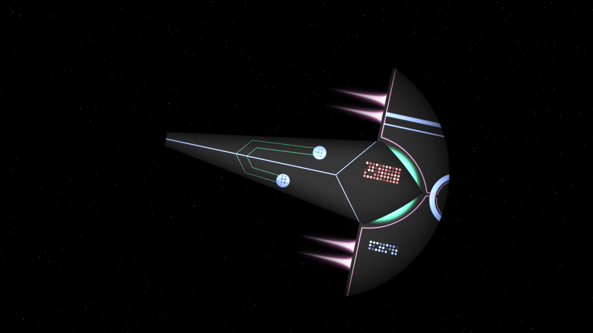

Space ship-like 2D object created using SDF. <https://www.shadertoy.com/view/4dGBWy>

SDF Functions:
--------------

[**2D SDF**](https://iquilezles.org/www/articles/distfunctions2d/distfunctions2d.htm) functions and [3D SDF](https://iquilezles.org/www/articles/distfunctions/distfunctions.htm) from Inigo Quilez.\
[**hg_sdf**](http://mercury.sexy/hg_sdf/)--- 3D SDF library.

[Short youtube video](https://youtu.be/q00V55R6oGM) that shows the creation of [shader on the screenshot](https://www.shadertoy.com/view/4dGBWy).
___

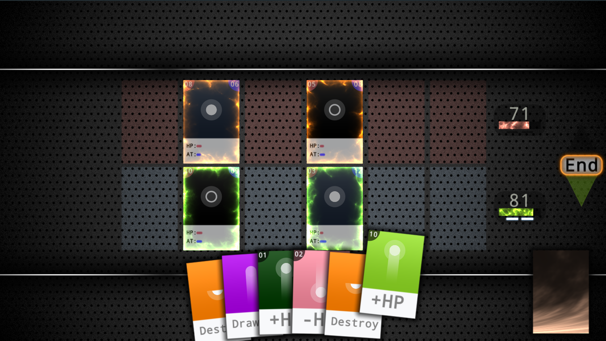

Screenshot from <https://www.shadertoy.com/view/wdlGz8>

User interface:
---------------

**To detect UI clicks** basic method/idea that used everywhere --- **call SDF function that generates part of your UI but instead of UV use Mouse position**:
```
float sdCircle( vec2 p, float r )
{
    return length(p) - r;
}
#define re iResolution
#define SS smoothstep
void mainImage( out vec4 c, in vec2 fc )
{
    vec2 res = 0.5*re.xy/re.y;
    vec2 p = fc/re.y - res;
    float d = SS(0., 1.5/re.y, sdCircle(p,0.1));

    // mouse pos in same as uv propotions
    vec2 im = iMouse.xy/re.y - res;
    // sdf base on mouse position
    float d_im = SS(0., 1.5/re.y, sdCircle(im,0.1));
    // mouse inside of seleted range
    if(d_im < 1.) d = 1.-d;
    c = vec4(d);
}
```
Usually, UI for games doesn't need lots of elements, UI does a very small performance impact.\
Also to draw UI can be used its own buffer to not explode shader code size.

A complex UI example can be found in this shader ---[**2D Vector Graphics Library**](https://www.shadertoy.com/view/lslXW8).

### Display text using Font texture:

[**Shader template**](https://www.shadertoy.com/view/llyXRW) - ASCII character encoding. To display numbers do the same as in ASCII --- add 48 to the number, number in the range 0 to 9.

### 3D Navigation:

I use [**this shader**](https://www.shadertoy.com/view/4lVXRm) as a template.

### Audio:

Shadertoy audio texture [**explained here**](https://gist.github.com/soulthreads/2efe50da4be1fb5f7ab60ff14ca434b8). Example [**audio shader**](https://www.shadertoy.com/view/Xds3Rr).

### Keyboard, Audio and other features full information:

[Special Shadertoy features](https://shadertoyunofficial.wordpress.com/2016/07/20/special-shadertoy-features/).

Optimization and debugging:
===========================

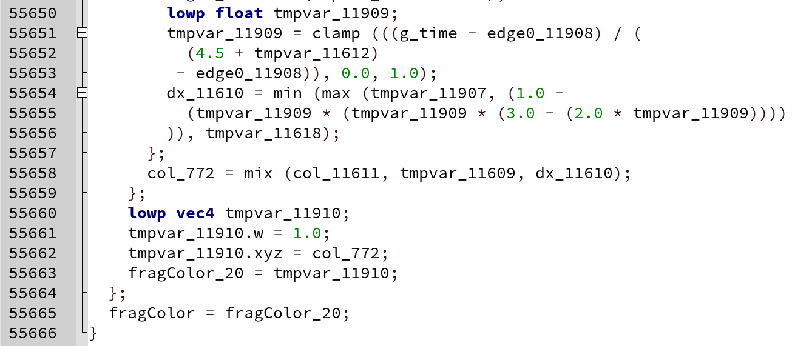

An unrolled version of my shader, 55k lines of unrolled code.

Optimization performance is about current shader logic, it way too big to discuss.

Optimize performance base on the multithreading concept. Do not have too much logic per single "thread", better separate large logic blocks to few separated threads(pixels).

Conditional logic can be considered as --- does not matter how many branches you have, modern GPUs way too fast anyway.

WebGL shaders optimizations:
----------------------------

Web browsers use [**ANGLE**](https://en.wikipedia.org/wiki/ANGLE_(software)) to pre-compile shaders and translate shaders to Native graphic API layer (Metal/DX/Vulkan/OpenGL/etc).

**ANGLE is a problem** --- ANGLE has lots of bugs and may generate absolutely broken shader code that may even crash shader compiler in the driver.\
Lots of useful information related to ANGLE can be found there [Avoiding compiler crash](https://shadertoyunofficial.wordpress.com/2017/11/19/avoiding-compiler-crash-or-endless-compilation/) and [Compatibility issues in Shadertoy and webGLSL](https://shadertoyunofficial.wordpress.com/2016/07/22/compatibility-issues-in-shadertoy-webglsl/).

Most common ANGLE Optimizations against code size exploding because of unrolling:

1.  Prevent loops unrolling do this *for (int i=0; i<N+min(0,iFrame); i++)*
2.  Remember that *const arrays* inlined in every use, the example of this problem [shown here ](https://www.shadertoy.com/view/fsSSzd)--- 200 lines of code [exploded to 22000 lines](https://danilw.github.io/GLSL-howto/test_shaders/unrolled_22klines_teest_nvogl.glsl), and driver can not compile it.
3.  Creating a large shader for WebGL never ends well --- **better separate shader code/logic to buffers, having 4 buffers with 25% of logic per buffer and short frame time is better than using a single buffer with 100% code and large frame time**.\
    [An example of a shader like this](https://www.shadertoy.com/view/tsfGW4) original shader used a single buffer where data initialized on frame 0--1, but the original shader compile time in WebGL was more than 30 sec. Splitting single buffer logic into 4 buffers reduces compile time to less than 1 sec.\
    This "idea" works even for complex 3D SDF scenes --- Image shader can mix parts of SDF that generated in every buffer (like forward rendering). (also Cubemap can be used to generate and store SDF --- [3D SDF as Cubemap example shader](https://www.shadertoy.com/view/Nd2XWK))
4.  **Do not use *texture* and/or *dFd* in the loops**. In some cases, this may lead to very low framerate and/or lots of errors and unexpected behavior in the shader. Instead of *texture* better use *textureLod*.

OpenGL/Vulkan shaders optimization:
-----------------------------------

Same as in WebGL *const **arrays*** inlined for every use by some driver-compilers.

**Do not use `#define`** for something complex, because it will explode code or leads to unpredictable bugs.\
Example of complex usage of define --- [Debug heatmap script](https://www.shadertoy.com/view/tllfDM).\
This leads to these bugs in some compilers ---[ Define bug](https://github.com/KhronosGroup/glslang/issues/2368).\
Another example of [Define bug in OpenGL](https://www.shadertoy.com/view/tdfGWS) GLSL compiler.

For full-screen postprocessing or just logic shaders in the buffers --- **having many buffers with shaders with short render time is better than a single buffer** with one shader for everything, divide into parts logic and put to multiple buffers.

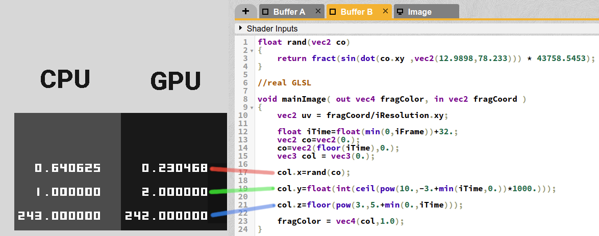

Pre-calculated vs GPU real-time values. <https://www.shadertoy.com/view/wdXGW8>

Shaders and constant expression:
--------------------------------

Solution of constant expression depends on GLSL compiler, in many cases its solution not equal to expected or GPU-side result.

Examples:

1.  `#define PI (4.0 * atan(1.))` or `#define E exp(1.)` it may or may not be solved in pre-compile time, and if it solved result may not be expected `PI` or `E` value.\
    **Define const numbers as const values, not as const expressions**.
2.  `sin` and `cos` and other trigonometric functions have very different results on the GPU on big input value (40000 and more) that makes any sin-hash/noise unpredictable and unstable depends on GPU.\
    Also, this leads to sin/cos and other solved on CPU will not be equal to GPU solution, [**pre-calculated Hash vs real time*](https://www.shadertoy.com/view/wdXGW8).
3.  `pow` in the GPU has a very big error, `floor(pow(3.,5.))` will be 243 on CPU and 242 on GPU. [pre-calculated example](https://www.shadertoy.com/view/wdXGW8#). **Do not use pow for integer multiplication**.
4.  Working with float-bits may not be the same on CPU and GPU, [**example floatBitsToUint**](https://www.shadertoy.com/view/tlfBRB) not expected results.
5.  GLSL compiler may remove constant multiplication by 0 or may not.
6.  Conditional logic solved from left to right, when first false found in this line everything that left on the right side will be dropped:\
    `bool tmp=(x>0)&&((y+=1)<0);`\
    *First part `x>0` will be calculated always, when `y+=1` may not be calculated.\
    **Do not put complex C-like logic to a single line**, the result may be not expected.\
    **Always move "fast function" to the left side of the condition**.

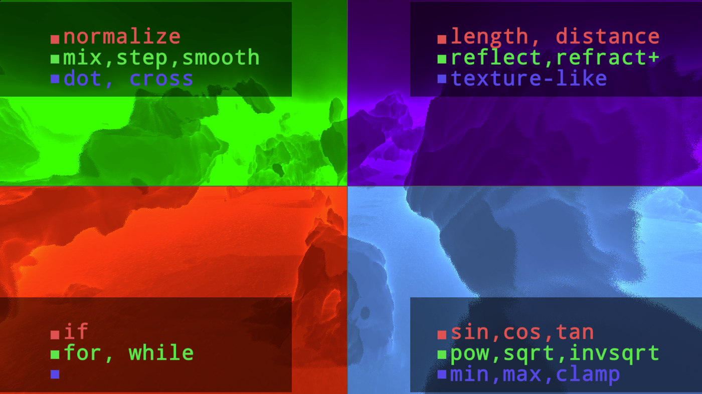

Debug heatmap script <https://www.shadertoy.com/view/tllfDM>

Debugging:
----------

I found the most useful way is --- [a minimal application](https://github.com/danilw/vulkan-shadertoy-launcher/releases) that does texture saving to file or frame by frame debugging, I use Shadertoy only to debug WebGL shaders.

Maybe can be useful --- this my [Debug heatmap script](https://www.shadertoy.com/view/tllfDM). Display number of function/logic calls per pixel but in most cases its obvious without a script.

I have not found useful GLSL emulation on the CPU.\
Chrome and Mesa software GLSL emulation has way too many bugs, in most cases, it can not even load my shaders.\
Other emulators for example SPIRV-VM also have [way](https://github.com/dfranx/SPIRV-VM/issues/2) [too](https://github.com/dfranx/SPIRV-VM/issues/3) [many](https://github.com/dfranx/SPIRV-VM/issues/4) bugs and the result of calculation from complex shader is not equal to shader on the GPU result.

The way to **set up GLSL emulation** described there: [**github.com/danilw/GPU-my-list-of-bugs**](https://github.com/danilw/GPU-my-list-of-bugs). Read Debug section on the page.

The edge of the Games in GPU:
=============================

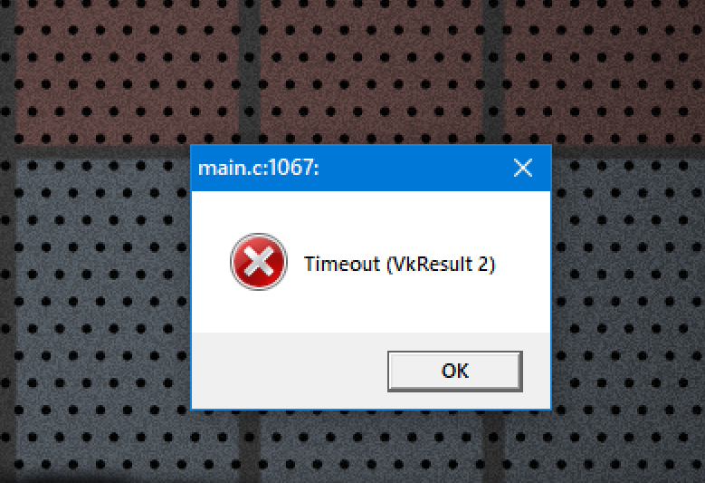

Error in some GPUs on using a large shader.

WebGL:
------

[Avoiding compiler crash](https://shadertoyunofficial.wordpress.com/2017/11/19/avoiding-compiler-crash-or-endless-compilation/) and [Compatibility issues in Shadertoy and webGLSL](https://shadertoyunofficial.wordpress.com/2016/07/22/compatibility-issues-in-shadertoy-webglsl/).

OpenGL/Vulkan:
--------------

Also look at my [GPU-my-list-of-bugs](https://github.com/danilw/GPU-my-list-of-bugs).

Hardware limitations --- depends on GPU:

1.  *Loop in the loop in another loop* with complex logic on every level.\
    **Shaders do have a complexity limit**, and when used many loops --- this shader may not work on many low-end GPUs like integrated or mobile GPU.\
    [Example bug report](https://community.amd.com/t5/opengl-vulkan/amd-vulkan-driver-spir-v-shader-very-critical-bug/td-p/199038) of this case in Vulkan.
2.  **Size of the compiled shader** --- also another hardware limitation that depends on GPU.\
    I do not know the exact limits, I think when unrolled code size less than 1000 lines everything should be fine, or SPIR-file size less than 200Kb shader should work everywhere.\
    [Example bug report](https://community.amd.com/t5/opengl-vulkan/vulkan-loading-compiling-spirv-in-amd-driver-use-too-much-ram/td-p/263709) of this case in Vulkan.
3.  **Frame time** --- Windows OS have a *limitation of 1-sec* frame render time or GPU driver will be rebooted, or blue screen if GPU freeze.\
    On Linux no such limitation, but having a shader that freezes GPU for more than 1 sec is very bad.\
    When you have a very slow shader --- render shader in small tiles, using *reading from the previous frame* in the buffers or *discard* if supported. [*Example shader*](https://www.shadertoy.com/view/tltBzM) using discard and for buffers using reading last frame.
4.  Various hardware bugs in some cases.\
    Example of such bugs --- [bug with memory in shader](https://community.amd.com/t5/opengl-vulkan/amd-vulkan-driver-spir-v-shader-much-more-critical-bug/td-p/117112) and [bug shader noise](https://community.khronos.org/t/nvidia-vulkan-driver-has-bugs-in-executing-spir-v-shaders-that-work-correctly-in-opengl/105998).\
    Almost every my complex shader discovers some new GPU-related bugs.\
    *To avoid most of the GPU limitations just use the newest and most powerful GPU you can found.*

Games in the shaders, links:
============================

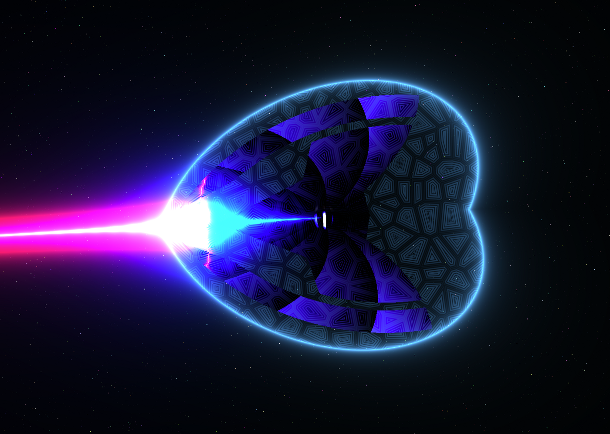

From my shader-game Sgame.

My games in the shaders:
------------------------

0.  [**Sgame (youtube video link)**](https://youtu.be/lVCIEaFEMO4) --- my first try of creating a game in the shader, only physics calculated on the CPU.\
    [Launch link](https://danilw.github.io/GLSL-howto/sgame_ntwgl/sgame.html). *Warning**:* clicking this link may crash your browser.\
    Shader [source code](https://github.com/danilw/cputests/blob/master/glsl/myfs.glsl).
1.  [**Getting Over...GLSL?**](https://danilw.itch.io/goglsl) ---my try using 2D SDF physics in the GPU.\
    Shader that used for GPU physics [source link](https://www.shadertoy.com/view/XtlBWl).\
    My other shaders [source code](https://github.com/danilw/getting-over-glsl/tree/master/shaders).
2.  [**Card game in the single shader**](https://www.shadertoy.com/view/wdlGz8) --- large linear logic TCG-like game concept with minimal AI-bot. To launch on Shadertoy remove *#define NOCOMPILE* from Common and press Compile(run).\
    [Youtube video of my Card game](https://youtu.be/xMTVUL1_10M).\
    Alternative [75Kb exe download](https://www.pouet.net/prod.php?which=84806), Windows only.
3. [**GLSL Auto Tetris**](https://medium.com/geekculture/launching-619-thousand-tetris-on-gpu-their-rendering-and-a-simple-bot-f2449b607db1) --- blog post link, read description there.
4.  An [**unfinished game** (youtube video link)](https://youtu.be/5Wzj-GNAo6c) where I tried to use *blend* to draw many small elements. Download links in the youtube video description.\
    Shader [source code](https://github.com/danilw/vulkan-shader-launcher/blob/master/example_game/shaders/src/main_image.glsl).
5.  [**We need more likes, playable**](https://www.shadertoy.com/view/3syXDD) --- very minimal clicker.
6.  [**Game for Cactus Jam**](https://www.shadertoy.com/view/NlXXW2) --- downlload links listed on Shadertoy page.

Other games on the Shadertoy:
-----------------------------

List of 151 [Playable games in Shadertoy!](https://shadertoyunofficial.wordpress.com/2017/11/11/playable-games-in-shadertoy/)

Export template:
================

I use only my own [**Vulkan-Shadertoy-Launcher**](https://github.com/danilw/vulkan-shadertoy-launcher/) (source code there).\
I do not recommend OpenGL applications because way too many bugs in OpenGL.

For other templates for exporting look at my previous blog [Into Shadertoy and Shaders useful links and tips](https://arugl.medium.com/into-shadertoy-and-shaders-useful-links-and-tips-7f3e2f192275) (*Offline Shadertoy related applications* section).

Thanks for reading!
