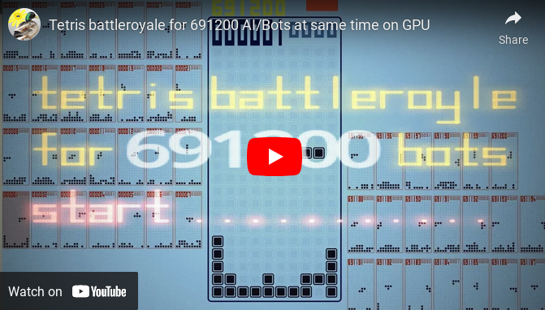
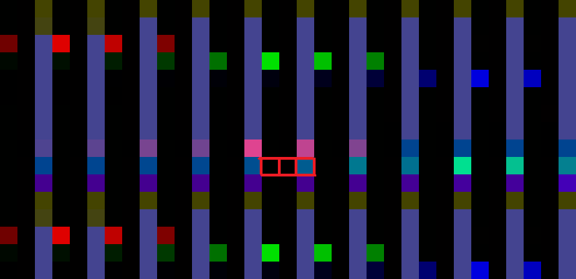
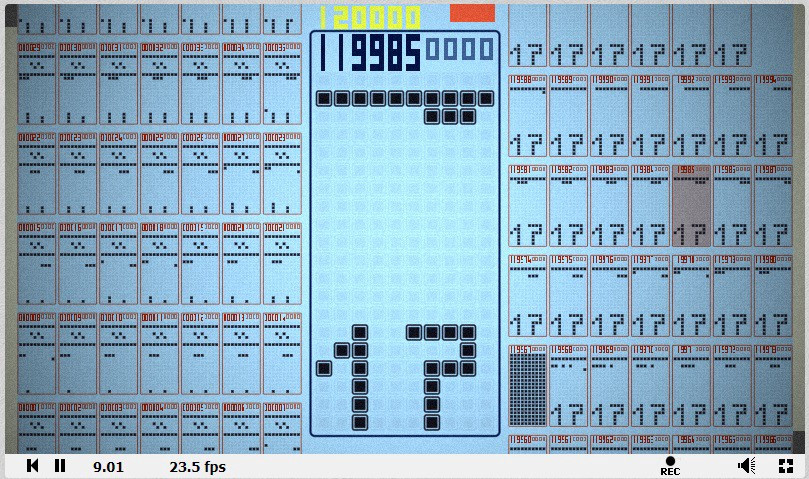
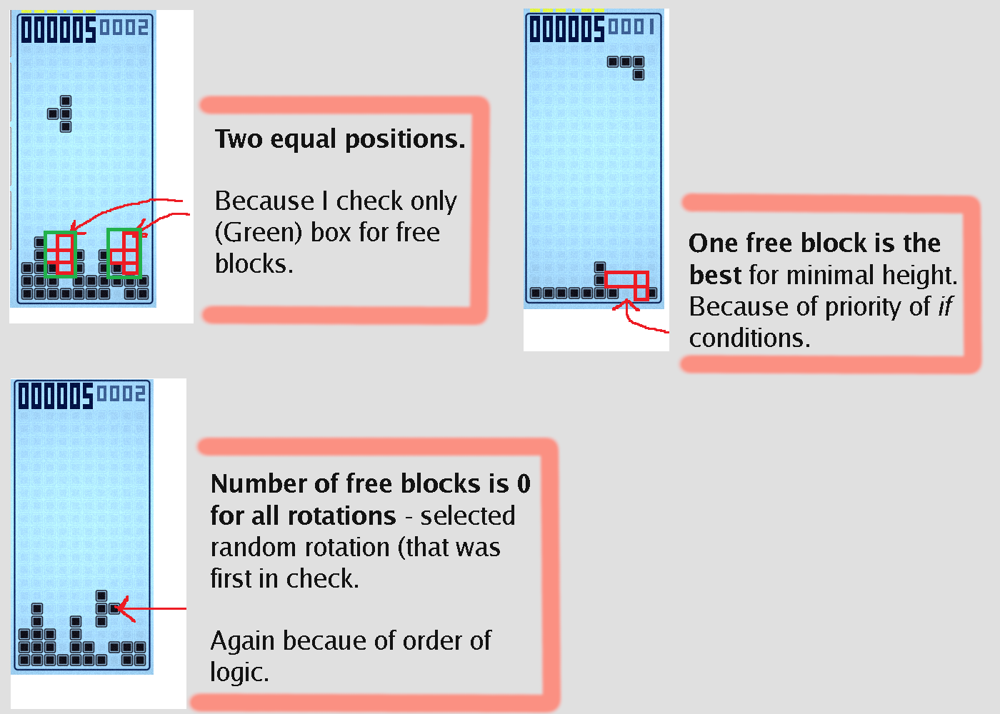
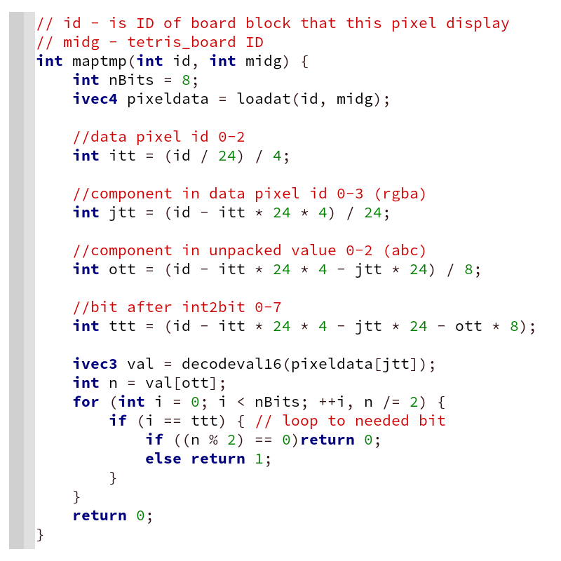
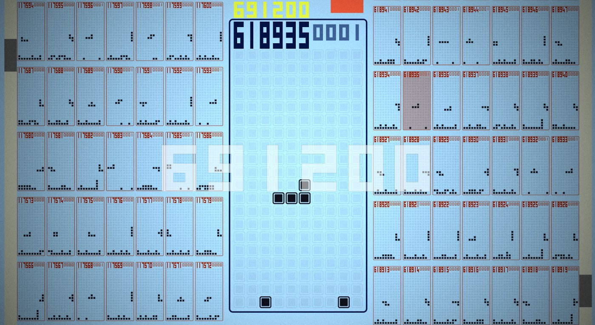
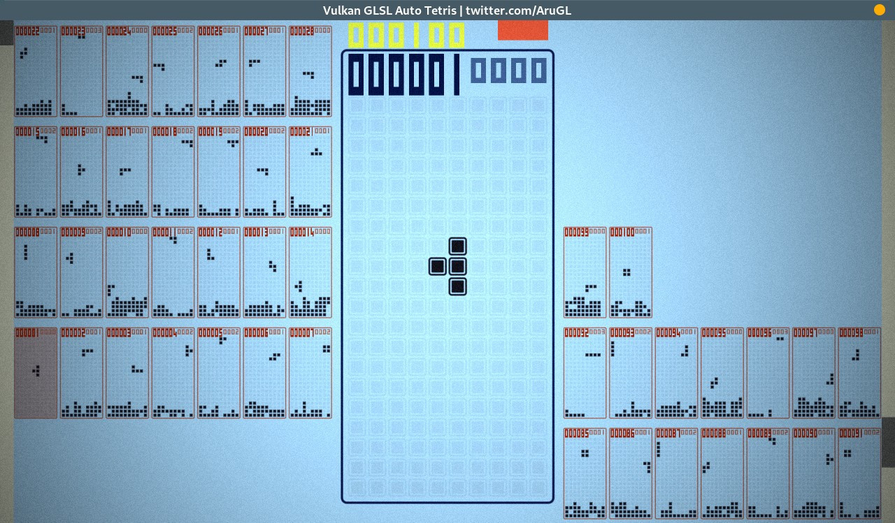

* * * * *

### Launching 619 thousand Tetris on GPU, their rendering, and a simple bot

GLSL Auto Tetris

#### **The idea:**

Make the **maximum number of simultaneously launched Tetrises** for one shader (one Framebuffer texture).

#### Download or Launch links:

-   Web-version *Shadertoy link* [**GLSL Auto Tetris**](https://www.shadertoy.com/view/3dlSzs).
-   **Binary version** only *WIndows* and *Linux*.\
    **58Kb** size on --- [**Demozoo portal**](https://demozoo.org/productions/295067/) link.

This is the 2021 updated version.

#### **Hardware requirement**:

Shader should work fine on **every 2015+ Nvidia GPU**.\
AMD just updated their GPU driver (update to latest driver version, summer 2021 or newer) and this shader now **works on AMD GPUs also** (tested Vega8 and AMD 560).

* * * * *

#### What is it:

Each Tetris runs in three pixels, for 1920x1080 resolution 619200 copies can be run at the same time.\
**Tetris board and logic saved in 3 pixels.**\
Also made a simple bot for auto-play.

*Below is a short description of how the resulting code works.*

* * * * *

#### Because this project is one of my first shaders, I can point these two mistakes:

-   Full Framebuffer texture calculated at once not in small tiles, as it should be.\
    This makes it impossible to launch simulations in real-time on low-end GPUs.\
    **If you download or trying web-version be careful using more than *100k* bots**. (more than 100k can be considered as stress-test for GPU)
-   In this project, **I use only 24 bits from 32 bits available in float**.\
    I use int `0xFFFFFF` without `uintBitsToFloat` function.\
    **Correct data(and bits) saving method --- look at my previous blog post** [***Games in the GPU shaders***](https://arugl.medium.com/games-in-the-gpu-shaders-a912414b1894)**.\
    **Changing saving logic from 24 bits to 32 bits will allow to pack Tetris board in just 2 pixels instead of 3.\
    But most of the performance slowdown comes from "logic pixel" and executing more "logic pixels" per Framebuffer size just leads to even more slowdown. (I did not change logic because it will result just even more slow performance)

* * * * *

### Tetris board saved in bits:

Table "Tetris" size `[10, 22]`(10 width, 22 height).\
Each cell can be either empty or not empty.\
A total of `22 * 10 = 220` bits is required to store the entire table.\
One "pixel" is four 24-bit floats, **96 bits per pixel**.

Visually (debug frame), three pixels are highlighted in red, this is one saved Tetris board.

Total to save only one Tetris board used:\
`2 * 96 + 24 + 4`\
**Two pixels, one float of the third pixel, 4 bits of the second float of the third pixel.**

There are **two unused floats left in the third pixel *pixel3.zw****,* they store the state of the logic:

-   **z** stores three 8-bit numbers `[a,b,c]`\
    --- ***a*** position of the current block, as the** *ID of the position in the array*** (array of size 220 bits, the maximum position is 220 which is less than 0xff)\
    --- ***b*** time until automatic fall down (***timer***) every frame `-1` to this number, as it becomes 0 then it falls on the block down\
    --- ***c*** ID of the current block
-   **w** store same `[a,b,c]`, but also the sign (positive or negative) of the total float is the flag of the ***end of the game in the current table*** (so as not to waste resources if the field is filled up)\
    --- ***a*** action, no action (0), left (1), right (2) and so on, full code in Common (source code line 20), ***actions*** have two states, *left_check* and if it is possible to move to the left, then the action is set to *left_move*.\
    --- `**[b,c]**` *0xffff*(16 bits) points of the current table, the number of lines that burned.

There are ***20 bits*** left unused in the second float of the third pixel.

* * * * *

#### Why do we need action IDs:

-   The data is stored in three pixels, it is ***impossible to simultaneously check the logic and change the data in one frame*** (without executing all the logic and loading the entire map in each pixel, the load will increase tenfold).
-   Therefore, the ***Data Storage logic*** works in each pixel and executes the received commands such as *left_****move***, the commands to check *left_****check*** are executed in only one pixel (the third).

#### Slow place:

-   Every third pixel (logic pixel) decompresses the entire map (reading all three pixels).
-   The other two pixels only unpack "themselves" (one pixel) to perform the stored action.
-   When the action is ***burn_line***, another pixel (part of the map) is loaded, as the table falls down and the lower parts of the table must know what is on top.

* * * * *

Debug screenshot with only data-saving logic.

#### Storage Algorithm Performance:

For testing, set *#define debug* in Common and *AI 0* there.

**I got this result** --- *10FPS* when rendering and processing all 619200 fields, for 120 thousand fields *25fps*.

* * * * *

**The logic of bot that also checks free blocks**, default bot does not do that, read below.

### Bot/AI logic:

I made a little better logic that also checks free blocks, on the screenshot.\
**Better logic** included to [binary version](https://www.pouet.net/prod.php?which=85052) or web-version and [source code Shadertoy link](https://www.shadertoy.com/view/wsXXzH).\
Added function ***check_block_at_wh*** to Buffer A (line 380).\
As you can see on the screenshot logic **checks only a small "region" of where Tetris-block can be dropped**.\
*I can not include it in the default Web version because WebBrowsers with ANGLE can not compile it. By performance it almost the same as Default bot, it just burns out a little slower than default.*

#### Default bot logic:

**Logic Very bad**, the bot burns out within a minute and gets up to 60 points. (original bot, modified burns 2--3x slower up to 300 points I saw)

I have not been able to run *good logic* with many loops to check free spaces and full map, calculating the best position based on all possible falls of the current block ...

**Good logic just does not work because of its complexity** --- adding just one more logical loop to current logic makes shader not work on my GPUs.\
(obvious solution --- do not perform full logic in one go and separate logic to many frames, like executing only one top-level-loop iteration per frame, I did not make it in this project)

#### My bot logic works like this:

All the logic is in the ***AI_pos_gen*** function in the source code *Buffer A* (line 394).

#### Pseudocode:

loop ( 4 rotation of current block )\
{\
    loop ( by width of table is 10 )\
    {\
        IF ( block_can_be_moved_here )\
        {\
            IF ( current_block_height and position\
                 less than the previous one )\
                THEN we remember best block_ID and best_POS\
        }\
    }\
}

function block_can_be_moved_here\
{\
    check in the loop(size of block)\
    that all elements of the map(tetris board)\
    are 0 where the elements of block are 1\
}

It three loops that are trivial --- they put the block so that the resulting height is minimal.

The ***AI_pos_gen*** function is called only once when a new block created and ***return*** the position on the top line where the block starts falling down.\
***Input*** is --- the block ID.\
The function works in the third pixel (logic) and loads the full map(Tetris board) from other pixels.

*I think this function can be easily modified to make your own bot-logic.*

* * * * *

### Interface / UI rendering

Rendering code in the ***Image*** shader, UI logic in the ***Buffer B*** source code.

**Rendering **--- splitting the screen into tiles and drawing in each tile, minimum load.

**The logic of loading the map to display** --- do not unpack the entire map every pixel, only the "necessary bit" is unpacked (literally), the function code:

Image shader line 280

* * * * *

#### **To avoid pixelation when scrolling:**

Starting from 43000 there is a loss of the fractional part of the float, and ***it will not work to add 619000 to the UV for scrolling*** (there will be pixels instead of tables).

**All scrolling is divided into one large tile and spins in a circle** adding a maximum of 32 to the UVs. (line 207 in Image).\
The same is done for getting a relative board ID. (line 215 in Image)

#### UI n**umbers:**

Yellow --- the number of Tetris boards.\
Large left --- the board_ID of the current board.\
On the right, the smaller one is the points of the current board.

* * * * *

### Launching and Advanced options:

#### Control in all versions:

Mouse to scroll and select boards.\
And keyboard arrows to move blocks in player mode.

#### To launch Web version on the Shadertoy:

-   if you on Windows --- launch (*Win+R hotkey*) Chrome using this command*\
    *`chrome.exe --use-angle=gl`
-   open this [**GLSL Auto Tetris**](https://www.shadertoy.com/view/3dlSzs) link
-   in the Shadertoy editor select *Common tab* and delete on line 4\
    *#define no_AI*
-   *optional* in Common you can change\
    *#define AI 199* to 0 or other custom value, or just keep it
-   press Compile button on the Shadertoy under text editor

#### To launch Binary version:

Just **download** from [**Demozoo portal**](https://demozoo.org/productions/295067/). Mirror [pouet](https://www.pouet.net/prod.php?which=85052).\
Only Windows and Linux supported.

#### This version has special options:

-   Space to pause. Esc to exit.
-   Keys *0 1 2 3* to set *demo mode* (number of bots), 0 is default.\
    *Extra keys*(WARNING!) 4 to 999k bots.\
    *And (do not press!) 5 (requires 2Gb VRAM) create 5.5mil bots. (scroll works correctly, board ID display only the last 6 digits of the number)*

The binary version is a Vulkan launcher with a built-in shader, the source code of the launcher on github [*vulkan-shadertoy-launcher*](https://github.com/danilw/vulkan-shadertoy-launcher).

* * * * *

Thanks for reading!
