Particle interaction on GPU shaders, particle-physics logic in WebGL/compute
===================================

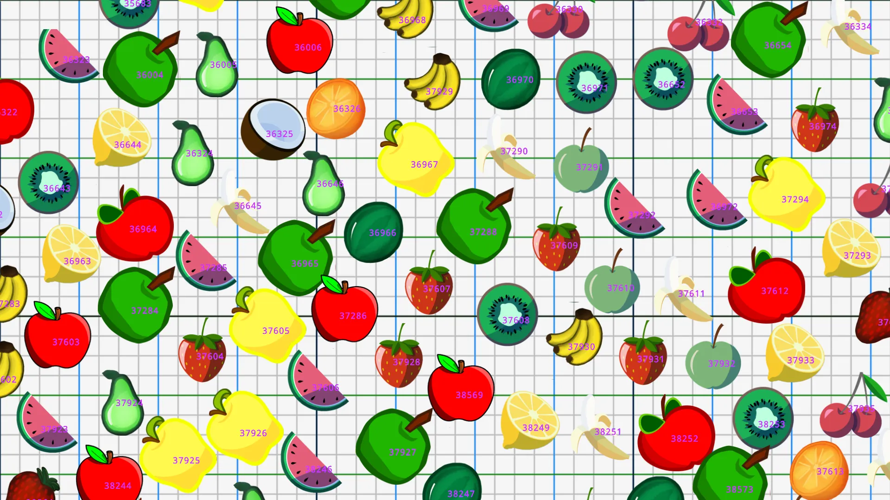

Interaction of hundreds of thousands of unique indexed particles on the GPU

Idea - collision/physics of hundreds of thousands of particles in real time, where each particle has a unique identifier.

The implementation I talk about here is made for WebGL2.\
*But it can easily be converted to a compute-shader.*

This is not a tutorial.
-----------------------

Here is only some information about this type of particle logic.

Content:
--------

1.  The basics of logic.
2.  Getting data by index of particle.
3.  Minimal shadertoy working example.
4.  How to translate this particle shader logic to rasterisation-rendering.
5.  Game example.
6.  More advanced techniques and more examples.
7.  Links to related text information/referenses.

Basics of particle logic in Shader:
===================================

How it works:
-------------

*Read voxels around and trade state base on state of self and voxels around.*

This is a "feedback" type of logic, or ["falling sand"](https://www.shadertoy.com/results?query=falling+sand)--- you read the previous saved state and save the current state based on the previous.

In GPU-shader-logic, "reading of previous state" - is reading the previous framebuffer and saving "current state" to the new framebuffer.\
And next frame - swap framebuffers.\
*This is the basic "double-FBO-swap" logic used by Shadertoy.*

Particles - Threads - Pixels.\
Particle - exist inside pixel, data is saved in pixel.\
Pixel=Thread - real location on "framebuffer-texture".\
Every thread/pixel read the previous self state at self-particle-data-position.\
And the state of pixels-particles around themselves to do "collision" and trade/change other information.

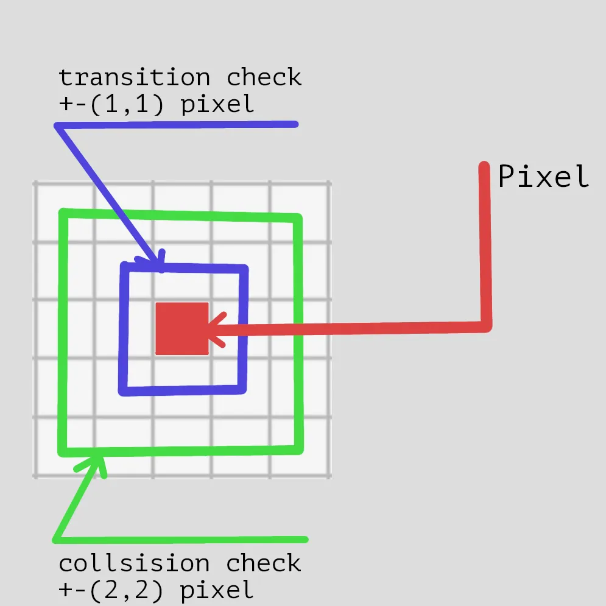

Particle-pixel data region to read.

To have "smooth particle movement" - particle in self data save fraction part of shift inside self pixel, and when this fraction part hit >0.999 then particle move on neighbor pixel.

Particle move on neighbor pixel:
--------------------------------

This part can be confusing - because "pixel" can not move, pixel can save only self-data at self position, and when particle movement hits >0.999 it needs move.

Particle data:
--------------

1.  position.xy vec2
2.  velocity.xy vec2
3.  index of particle - a static number that travels with data.

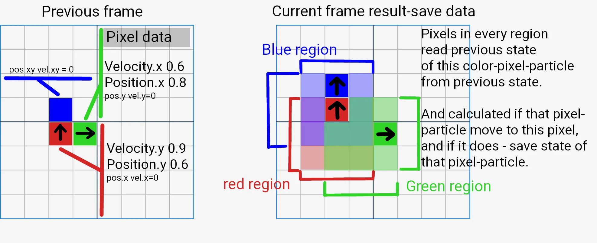

How pixels trade data without moving.

This is where "pixels trade data" - every pixel calculates collision/physics of movement with a neighbor, and every pixel knows which neighbor particle moves to "this position".\
When movement hits >0.999 - current pixel saves the data of the particle that moved to the current position, or empty space data.

And neighbor pixel that also calculate movement, neighbor pixel know that this neighbor particle move there and save this data - *not really "trade of data"* but pixels rewrite self state with state of neighbor, and neighbor do same because same calculation happens there.

In the example image above, you can see:
----------------------------------------

Green particle movement is Vel+Pos = 1.4 - Green particle move right to a new "position inside of the new pixel" = 0.4, and Velocity stays same = 0.6\
*And 3x3 Green-region calculated movement of **Green particle* - 2 pixels of green region change state based on green particle movement.

Red particle movement is Vel+Pos = 1.5 - the red particle moves to the pixel above, but there is a Blue particle.\
*To simplify the example,* assume physics logic calculates that, as a result, Blue particle move in the same direction as Red, and red particle keep moving.

You can see Red/Blue region intersect - means "old Blue pixel" read state of "Red particle" and calculate that "it collide" and result of this physics - is state of Red particle write to Blue-pixel.\
And next on top "previously empty pixel" - also read Red/Blue state and know that Blue particle move to this pixel and save Blue particle state.

This is a simple description of "falling-sand" logic.

The obvious limitation of this logic is:
----------------------------------------

1 particle per pixel, and particle speed is limited by the range where pixels read state, in the example above I used a 3x3 region.

3x3 region - I use this region size only as an example, in real use it can be bigger.

Getting data by index of particle:
==================================

Indexing - very important to understand.\
*I do not provide an example for this case, this is a description of how it should work.*

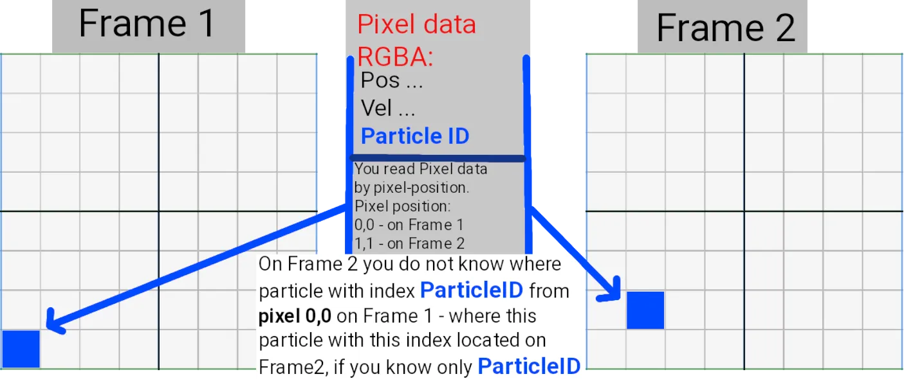

Particle travel with data and self index.

The logic of particle-shader-collision returns "particle data" at "pixel position".\
You read "framebuffer texture" by "pixel position" - means you can not read "particle data by particle index".\
*Particle index * - that index that saved in data and travel with a pixel.\
*Particle data* is pos.xy, vel.xy, particle-index-int.

Sorting of particle data by particle index:
-------------------------------------------

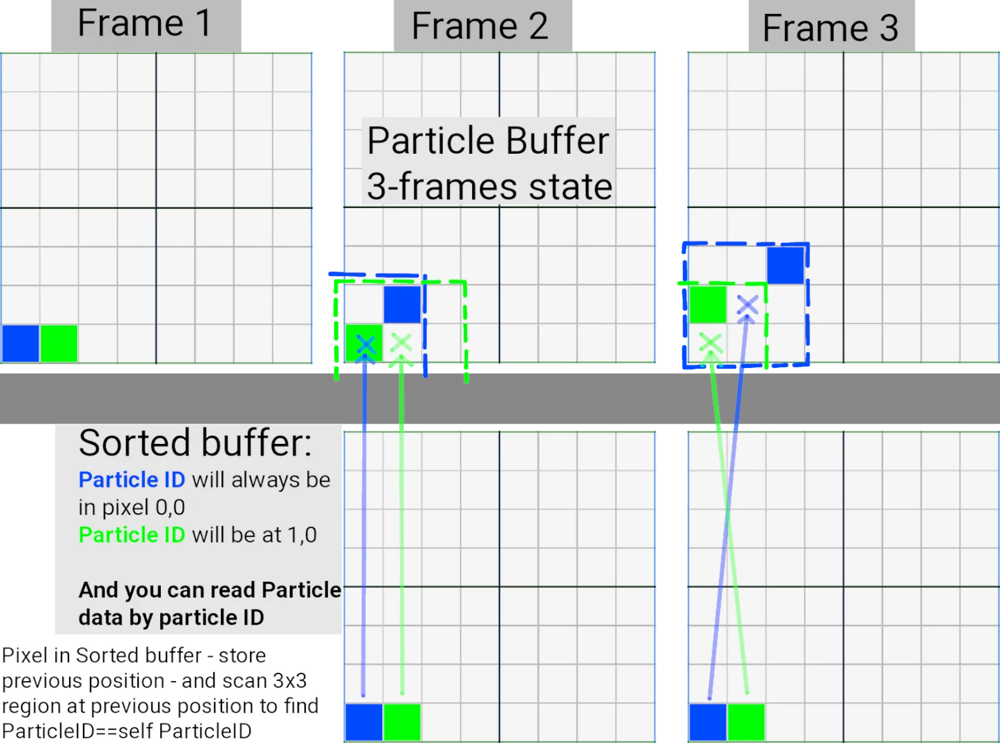

Sorting/tracking bugger logic.

Sorting buffer logic:
---------------------

On frame 0 - particles in the *particle-buffer* are randomly distributed, they may be present on a pixel, or a pixel can be free.\
Means you need to sort particles by index.\
And this is what *Sorting-buffer* do on frame 0 - read the result of particle-buffer and do sorting.

Sorting is a very expensive operation, which is why it should be done once.\
And then - *sorting-buffer* will just track/scan position change of ParticleID knowing previous position of ParticleID in *particle-buffer*.

Sorting-buffer save <particle position> for <ParticleID==self index>.\
Self index is the position of the pixel.\
You can read from *sorting-buffer * - the current pixel-position of a particle in *particle-buffer* by ParticleID.\
And knowing the pixel-position of a particle with ParticleID , you can read particle-data from the *particle-buffer* by pixel-position.

Minimal shadertoy WebGL2 working example implementation:
========================================================

Minimal logic in the WebGL2-fragment shader can be found here:\
<https://www.shadertoy.com/view/wdG3Wd>

In BufA, *you can see transition and collision checks* in the code.

I describe my modification of that shader:
------------------------------------------

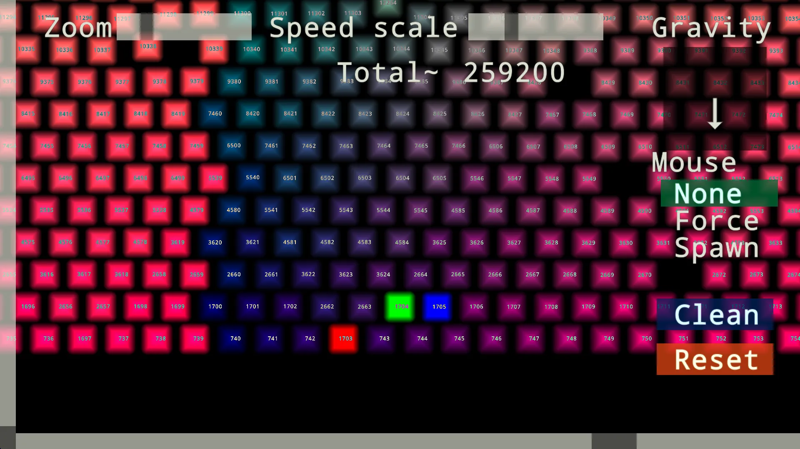

<https://www.shadertoy.com/view/tstSz7>

My modification is --- <https://www.shadertoy.com/view/tstSz7>

BufA - just Shadertoy UI, ignore.\
BufB - additional data, move Scale on the UI.\
BufC --- main particle shader logic. Logic can be copied to compute shader.\
Image - draw particles logic.\
*Look below to learn how to convert it to rasterisation.*

How it works:
=============

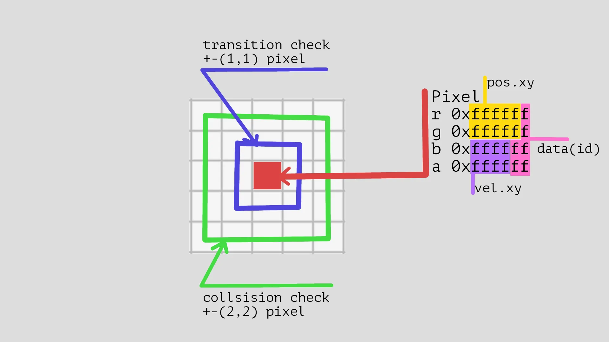

Save of state in WebGL2 rgba pixel.

Look at BufC in my shader link.

WebGL2 allows you to use RGBA textures with 32-bits per channel - 128 bits per pixel.\
In my shader, I do not use `intBitsToFloat/uintBitsToFloat` - I save data in a `0xffffff` 24-bit int value as a float, I also use sign-of float for speed direction.\
*This is an obvious improvement if you need - use full 32 bit range of float.*

Solution to store more data in WebGL2:
--------------------------------------

This "junk way" is only for WebGL2 - WebGL2 does not have compute.\
*And WebGL2 does not have compute *[*because*](https://groups.google.com/a/chromium.org/g/blink-dev/c/bPD47wqY-r8/m/5DzgvEwFBAAJ?pli=1)* of this *[*reason*](https://bugs.chromium.org/p/chromium/issues/detail?id=1131991)*:*

> macOS' OpenGL implementation never supported compute shaders.

In compute shaders - you can store any amount of data, not limited by RGBA framebuffer output.\
*Just use compute if you do stuff outside of WebGL2.*

To read:
--------

I have obvious example is BufB.\
Since every particle has its own unique ID - you can read unique data using this ID, for example I read "BufB data".\
Reading happens in the Image shader when BufC stores only particle-ID.\
*Move Scale on the UI to see it is working.*

To write/save more data in WebGL2:
----------------------------------

You need additional buffer, "BufD", with logic that will sort particles by ParticleID, as I described it above.\
And - modify BufC-particle logic to also save "Action ID" to perform, and BufD read also this "Action ID" and perform this action on BufD data.\
"Action ID" - generated by particle-collision-logic, for example when particle collide with "other specific index" generated ActionID.\
I use this type of logic in *Game example *below.

Limitations of this shader:
---------------------------

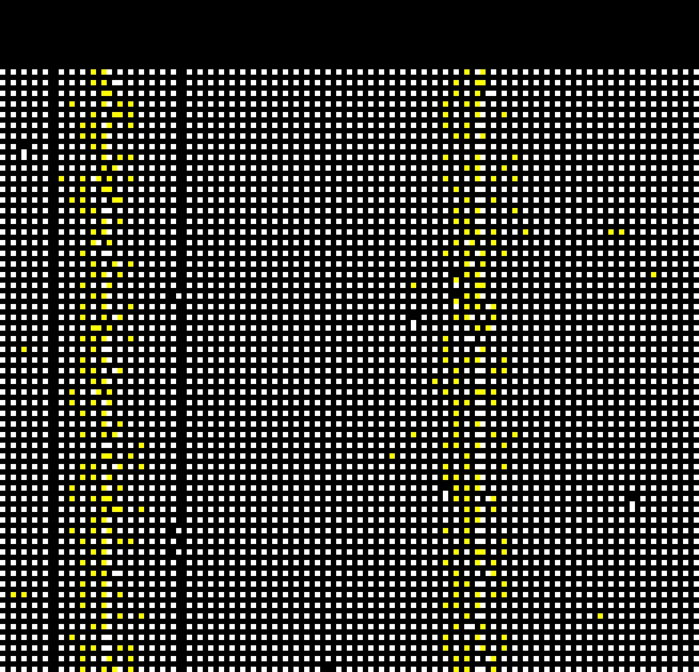

Real pixel-particles positions.

In Image shader, uncomment line 201 - that displays iChanel2.

You can see real-pixel movement and a 1-pixel empty border around every pixel.\
This 1-pixel region is used as a "transition".\
Particles do not stay within a 1-pixel range from each other.

Limitations of WebGL2 implementation:
-------------------------------------

1.  "*jittering*" you can clearly see on my shader - reason for it because I store velocity as `0xffff` int, so velocity step is `1.0/0xffff` and it visible.\
    *Can be fixed, look at the below game example.*
2.  Same for position - position is also stored as an integer, so there are limitations for how smoothly a particle can move.\
    *Look at a game example below.*
3.  Data is only in the `0xffffff` range - limit the amount of data to store or use the entire data as an ID.\
    *Above, I described the implementation of read/write logic for more data.*

Rasterisation-rendering implementation:
=======================================

particle_self_collision at <https://github.com/danilw/godot-utils-and-other>

Links:
------

[WebGL2 web-demo from video](https://danilw.github.io/godot-utils-and-other/particle_self_collision/minimal_example/web_demo/mini_example.html).\
Its [*source code link*](https://github.com/danilw/godot-utils-and-other), search project *particle_self_collision*.\
This is the Godot 3.5 port of my Shadertoy shader - but the rendering of particles is on rasterisation.

Obvious slowdown of my Shadertoy shader for this logic - is Image shader is fragment shader.\
*And to render "smooth particles" it works/render/read data from BufC in every pixel of the Image - many times "per particle" because every particle is many pixels in size.*

And if you use rasterisation - one particle can be just "quad", and you read data just once per particle-quad.\
*And then scale "quad" to any size on screen without needing to read data-per-pixel.*

Problem - is indexing:
----------------------

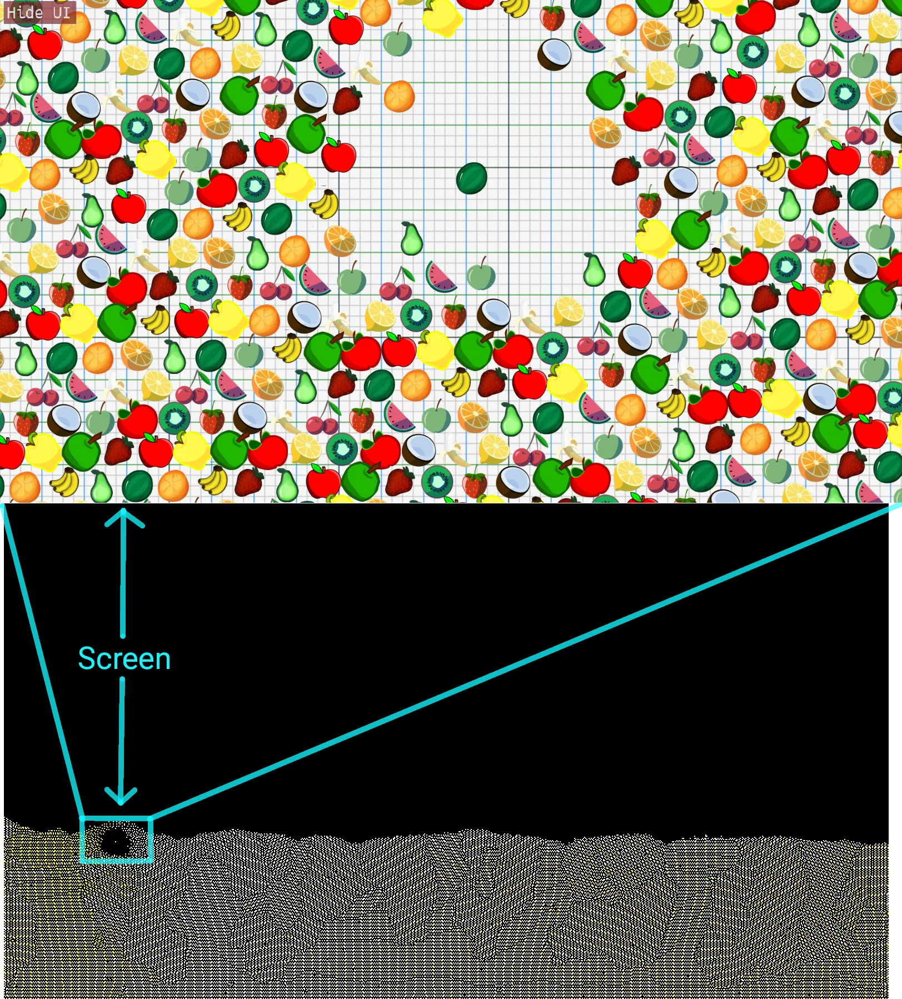

Region to read to display particles with this scale. Schematic image.

What you have:
--------------

1.  Rasterisation to render - indexed particles, whose index starts at 1.
2.  To render - in razterisation-particle-shader you read "data" just once per particle.

What you want:
--------------

1.  render particles on any scale.
2.  minimum overhead.

Problems to solve - indexing.\
You cannot read "particle data from particle-buffer by indexed-rasteresation-particles-index" - * you can, but* then you need number of rasterisation-particles to be equal to all pixel-particles.\
*Rendering "hundreds of thousands of rasteresation particles" when most of them are not even on screen because of scale - is a huge overhead.*

Minimum overhead - in the perfect case, the number of rasteresation-particles should be equal to the number of visible particles on screen with scale.\
*Screnshot above displays what I mean.*

Solution to rasterisation particles:
------------------------------------

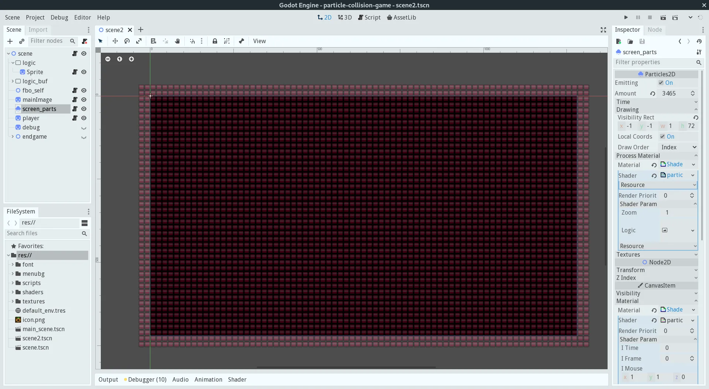

Every red-square is one indexed particle. 77x45 region.

The solution is simple - just calculate the "scaled region size in pixels of particle-buffer" and display this number of rasterisation-particles on screen.

Basically - one rasterisation particle is a "pixel" in the particle buffer.\
*That all, this simple.*

Yes, there is overhead:
-----------------------

You need to create a number of rasterisation-particles equal to "region size".\
For example - the visible region is 160x90 is 14400 rasterisation particles .\
This is alot.\
And from this 14400 - only few can be "actually visible" in particle-buffer, so 14k+ will be just overhead and only one drawn on screen.\
*On screenshot above - 77x45 region.*

But drarwing up to 100k rasterisation-particles-quads - is cheap for even 10yo GPUs.\
It works well when "scale is big".

When rasterisation-particle size is smaller than 6x6 pixels on screen:\
From this point, it will be cheaper to *draw* all particles in fragment or compute shader as "pixel-particles" without rasterisation.

*I mean - if you want to draw 1:1 particles on screen without scale - hundreds of thousands of particles - do drawing in fragment or compute shader.*\
Creating/rendering hundreds of thousands of rasterisation-particles will be more expensive and slow than rendering everything in shader.

Game example:
=============

Links:
------

[WebGl2 webbrowser version](https://danilw.itch.io/flat-maze-web) of this game.\
flat-maze game [*source code*](https://github.com/danilw/flat-maze) - this is the Godot 3.5 project.

Control:
--------

Keyboard w/a/s/d or arrows, and mouse left/right click.

Main features/difference from Shadertoy shader logic:
-----------------------------------------------------

1.  Particles do not have *"jittering" * - they can all stay and move very smoothly.
2.  *"Action ID"* logic - particles on collision "generate action" based on the type of object they collide with.
3.  Timers for particles are used for "burning/turn" trees to other type.

Every tree is particle with logic.

*Particle-collision logic code in *[*particles_fbo_logic.shader*](https://github.com/danilw/flat-maze/blob/master/flat_maze/shaders/scene2/particles_fbo_logic.shader)

// data\
// in [x,y,z,w]\
// x-posx\
// y-posy\
// z-0xffff-velx, 0xff-data\
// w-0xffff-vely, 0xff-data

//in data(0x[ffff]) stored:\
//[its type][its HP]\
// HP-values 0-0xff when HP==0 types go down\
// type:\
// 1-2 ghost\
// 3-zombi\
// 4-18 blocks\
// +20 is on fire\
// 40 is bullet(right) 41 left 42 top 43 down

To fix "jittering":
-------------------

I just store pos.xy in the full float range without converting to int.\
Pos.xy use the full range of two 32-bit floats.

Data:
-----

I have only `0xffff` for data - not a lot to store unique indexes.\
*But I do not need a unique index for every particle.*

I need "group index" - is particle is tree-type, ghost or something else.\
*Every group has its own index.\
*`0xff` for group index and `0xff` for HP, HP is also used as a timer when groupID is "tree burning".

Logic:
------

I do use "Action ID" logic - but I do not store actions.

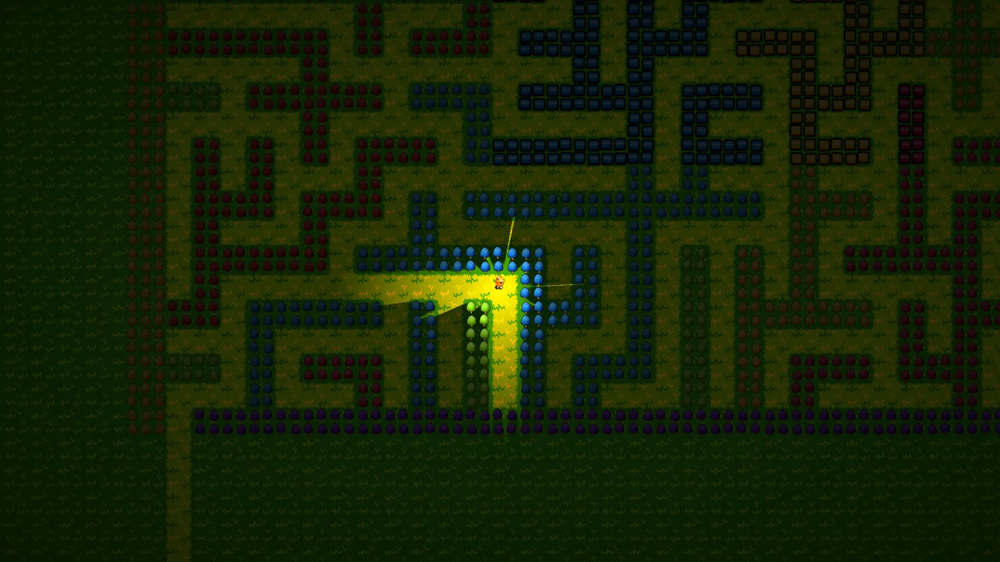

Search for `need_upd` [in shader code](https://github.com/danilw/flat-maze/blob/master/flat_maze/shaders/scene2/particles_fbo_logic.shader#L481).

If-condition `(boolean condition)` is - "Action ID".*\
*`(consequent)` is an Action that applies to this "Action ID".

This logic generates Action on checking for "what ID particle collides with".\
And I apply this action - because I need only "group ID" and HP to change.

I do not need to change more data for this case - this is why all logic in one shader and buffer.\
`0xffff` data is enough for this case.

In more complex situations, code, or logic:
-------------------------------------------

For WebGL2:\
Particle-collision-buffer should generate "*Action ID*" and other "sorting/tracking shader-buffer" should read this action and apply it.\
*Read the decription of "Sorting buffer logic" above.*

In the compute shader:\
You can combine collision-shader logic with actions-logic in a single shader.\
Because you can read/save any size of data without being limited, like in WebGL2.

*But if you need to access particle-data by "particle ID" - you need sorting shader.*\
Then move action-logic to the sorting shader, or even to its own shader that will read sorting-shader-result by "particle ID".\
And for "general compute-shader optimization" - is better to have action-logic in its own shader.

More advanced techniques and more examples:
===========================================

The next step of logic like this - is creating groups of objects, calculate center of mass of the group, and then collide objects larger than 1-particle.

Also - [Voronoï particle tracking](https://www.shadertoy.com/view/3ty3Dy).

Also - more complex logic for "particle communication" like water physics.\
Even light-tracing can be presented as logic for particle communication.

<https://www.shadertoy.com/view/NlScDz>

*Similar Art using particles - *[*https://www.shadertoy.com/view/7tGcRm*](https://www.shadertoy.com/view/7tGcRm)

Links to complex examples in Shadertoy shaders:
===============================================

*Look *[*particle tag on Shadertoy*](https://www.shadertoy.com/results?query=tag%3Dparticles&sort=love&filter=)*.*\
*And *[*voronoitracking tag on Shadertoy*](https://www.shadertoy.com/results?query=tag%3Dvoronoitracking&sort=love&filter=)*.*\
*And *[*physics tag on Shadertoy*](https://www.shadertoy.com/results?query=tag%3Dphysics&sort=love&filter=)*.*

2D:
---

1.  <https://www.shadertoy.com/view/WtfyDj> - Liquid by Mykhailo Moroz.\
    *Check *[*Mykhailo Moroz blog*](https://michaelmoroz.github.io/Reintegration-Tracking/)*.*
2.  <https://www.shadertoy.com/view/dstfR2> - Solid and Liquid by wyatt.\
    *Look other wyatt shaders - there many shaders related to particles.*
3.  <https://www.shadertoy.com/view/WlVyRV> - Dry ice 2 by xjorma.\
    *Smoke-like in 3d-plane.*
4.  <https://www.shadertoy.com/view/NtcBzX> - Candy Mixer by fenix.
5.  <https://www.shadertoy.com/view/cdlXDH> - Gummy Worm by fenix.
6.  <https://www.shadertoy.com/view/fld3R4> - Light Propagation by paniq.\
    *There no "collision" happening, just as idea of light as particle.*

Very complex solid/soft-bodies:
-------------------------------

1.  <https://www.shadertoy.com/view/3lKSDV> - Destructible by wyatt.
2.  <https://www.shadertoy.com/view/WsjcRV> - Little Letters by wyatt.
3.  <https://www.shadertoy.com/view/lf2SDD> - Physical Donuts by spalmer.\
    *Voronoi particle tracking.*
4.  <https://www.shadertoy.com/view/wdGcRK> - Buildings by michael0884.\
    *Press Space - zoom in.*
5.  <https://www.shadertoy.com/view/4cfSz8> - by UnstableLobster.\
    *Voronoi index-space particle buffer to make stiff soft-bodies.*

3D:
---

Logic is same - just add one more dimension to voxels.\
And to process-logic you need more memory `X*Y*Z` size of buffer.\
And you will read 3x more memory because one more dimension.

1.  <https://www.shadertoy.com/view/Dd2SRt> - 3D aurora by lomateron.\
    *Just very simple example of 3D-voxels to 2D buffer, look BufA BufB.*
2.  <https://www.shadertoy.com/view/wtcGzB> - Reaction Diffusion 3D, wyatt
3.  <https://www.shadertoy.com/view/7lKczD> - Spark Volcano by fenix.\
    <https://www.shadertoy.com/view/7tyyW1> - Sparks on Swiss Cheese Mountain by fenix.\
    *Both - very interesting particle example in 3d. But no particle self-collissions.*

There are not many examples of 3d-particle physics on Shadertoy, mostly only smoke and liquid physics.\
Because rendering many 3d particles in a fragment shader - is a complex task by itself.\
*You can check *[*this shader*](https://www.shadertoy.com/view/wllcR7)* to see the complexity of good-particle rendering.*

Links to related text-information:
==================================

1.  [GPU Gems 3](https://developer.nvidia.com/gpugems/gpugems3/part-v-physics-simulation/chapter-32-broad-phase-collision-detection-cuda) - Chapter 32. Broad-Phase Collision Detection with CUDA
2.  Similar to this my blog post - search in the internet.\
    I saw Mykhailo Moroz's [Reintegration tracking blog](https://michaelmoroz.github.io/Reintegration-Tracking/).
3.  If you look for references - [Fast collision detection using the A-buffer](https://www.researchgate.net/publication/225595781_Fast_collision_detection_using_the_A-buffer).\
    In this document, look for references at the end.

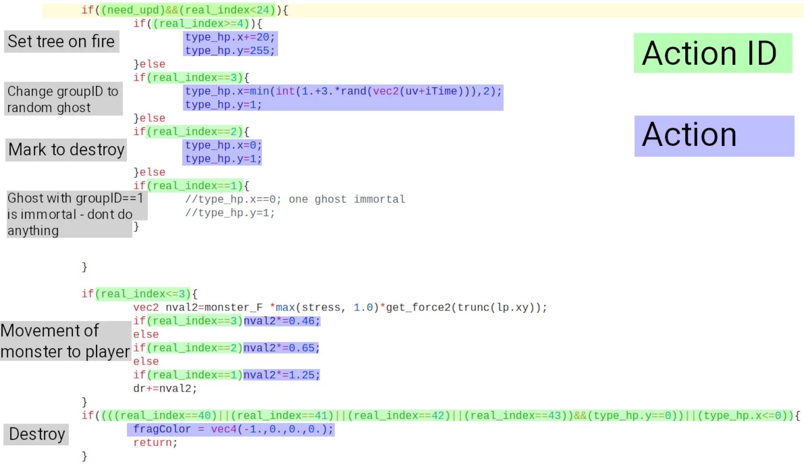

The end, thanks for reading. Really hope some information from this blog is useful for you.
