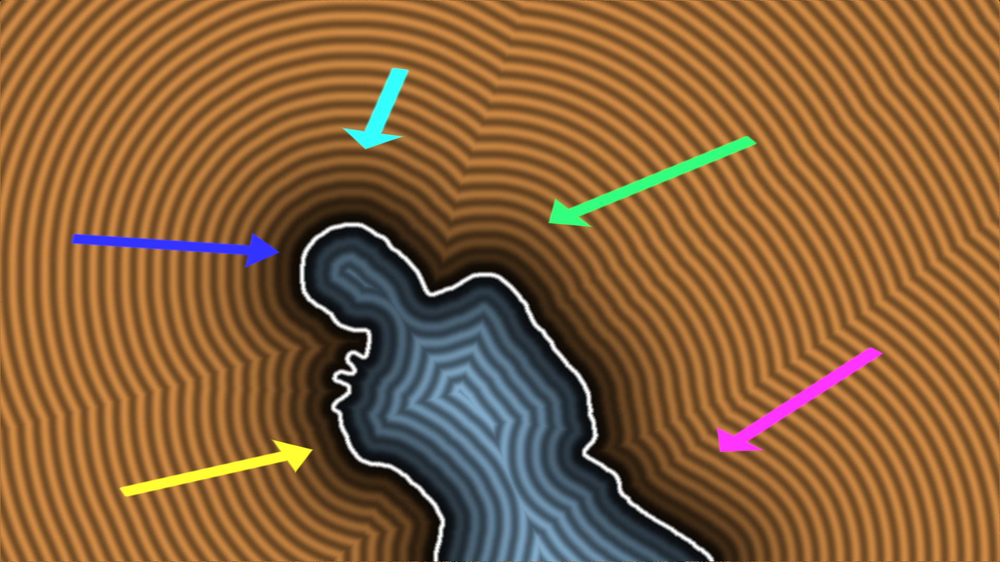
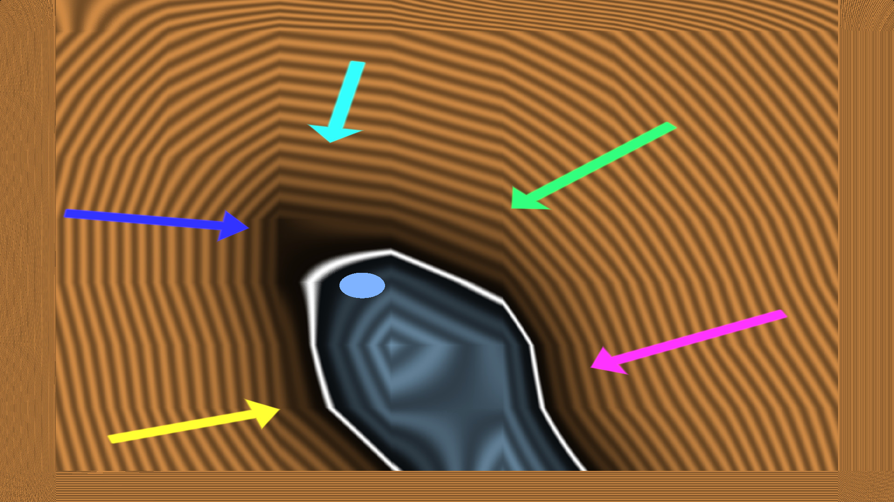

* * *

### Position of object on image without AI/ML — Jump flooding algorithm

Image-mask to distance field and display normals of SDF

**Idea** — select object on image as image mask and generate SDF to get position of this object. Also use Mipmap layers to optimize logic.

**Implementation** — links provided in description.

**This is not tutorial.**

* * *

#### Content:

1.  Single frame JFA base implementation — _by_ [_Inigo Quilez_](https://www.shadertoy.com/view/4XlyW8).
2.  Optimized realtime JFA — _by_ [_Flyguy on Shadertoy_](https://www.shadertoy.com/view/Wl3fWX).
3.  _SDF to single position-coordinate._
4.  **Overview of possible Mipmap optimizations.**
5.  Object detection **using only Mipmap layer** — _by_ [_FabriceNeyret2_](https://www.shadertoy.com/view/XfdcWj).
* * *

### Single frame JFA base implementation:

[_Jump flooding algorithm_](https://en.wikipedia.org/wiki/Jump_flooding_algorithm) _on Wikipedia._

Great implementation by Inigo Quilez — [**Signed Jump Flooding**](https://www.shadertoy.com/view/4XlyW8).

> Signed Jump Flooding, to create a SIGNED distance field of a shape of which we only know it’s inside and outside regions.

This implementtion use 10 to 16 passes to generate SDF to mask.
And for-loop use alot-of-texture-steps((_passes_ x2)² per pass) to build SDF.
_But result is very high quality._

it is possible to do in real time — that will cost 10–16 “compute-layers” — fine for most of modern GPUs performance but can be optimized.

* * *

### Optimized realtime JFA:

[**Van Damme — Distance**](https://www.shadertoy.com/view/Wl3fWX) **—** by Flyguy on Shadertoy.
It better for real time use — because there only:

    for(int i = \-1; i <= 1; i++)
    {
        for(int j = \-1; j <= 1; j++)

And only 6-passes — used single cubemap buffer and every cube-face look on other-previous cube fase to build JFA.
_(this why it delayed by 6 frames from video — can be improved by procesing 6 buffers one after other)_

Because this is so “_cheap_” by performance — it will work literally on anything — performance can be calculated linearly.

_((Multiply image resolution_ `_x*y_`_) x3x3) x6_
For 256x256 image it will be 3538944 iterations — multiply by 100(~number of operations per iteration) = around 400MHz single core processor can be enough to preceess it in real time.

Screenshot on top of this article is from this implementation — screenshot displaying SDF-normal arows.

* * *

Example of possible Mipmap use case in JFA.

### SDF to single position-coordinate:

Simple — get multiple points-normals and calculate center.
_(summ of vectors)_

To get better position of center — more points needed.

**But summ of multiple points — is Mipmap.**

You can just apply mipmap layer to SDF and get better position with less points.

* * *

### Overview of possible Mipmap optimizations:

Not a single JFA algorithm above use Mipmaps.

When core of JFA — is loop in some range of pixels to “blur the edge”.

I think Mipmaps can be used in JFA to find object bound-box, to get center-position, and even to implement full JFA thru mipmaps.

* * *

### Object detection using only Mipmap layer:

#### Notice:

[**FabriceNeyret2 blog — GPmipmap Mipmap Advanced tricks**](https://shadertoyunofficial.wordpress.com/2021/03/09/advanced-tricks/)**.**

Cotext — [**dynamic centering Britney**](https://www.shadertoy.com/view/XfdcWj) _FabriceNeyret2 Shadertoy shader_.

Look at this implementation — used only Mipmap layer to get position of mask.

And as “algorithm” — is single line `textureLod(iChannel1, vec2(.5), 99.)`

Just read last Mipmap layer — last Mipmap layers is "average summ of all pixels".
_Very interesting and impressive finding by FabriceNeyret2!_

This is so cheap by compute-performance — it require no compute, just memory reading and Mipmaps calculation can be done on hardware level — literally just scale-connect memory linearly — no compute.
