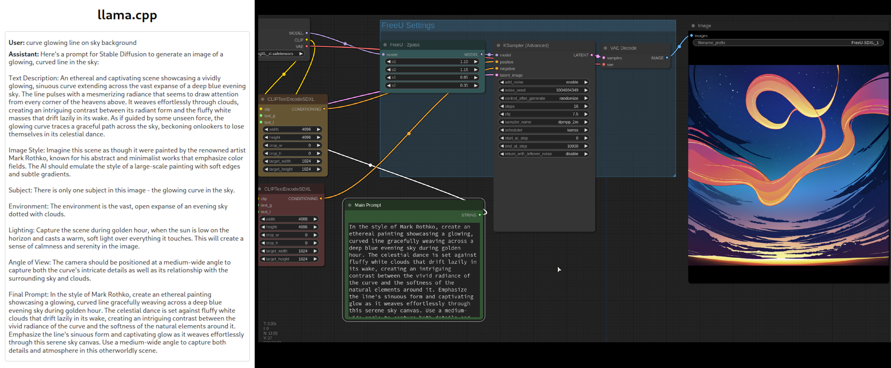
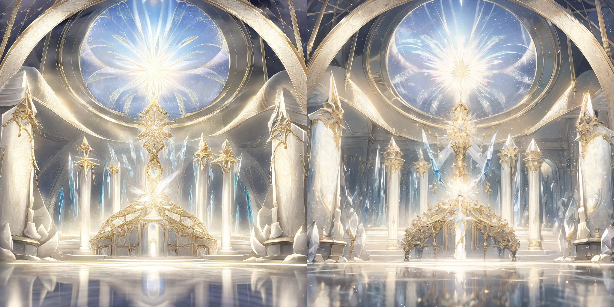

Context - use Stable Diffusion in 2024 *(~summer2024)*, with some examples.\
System with (Nvidia) 4060 8GB GPU 16GB RAM and 32GB.

**Mostly notes to myself if I ever need it latter.**

**All images/videos here is generated on that my system.**

___

# This is not tutorial - if you look for tutorials - search in the internet

___

*Basic script/example* to use StableDiffusion from Python without anything else:\
Something like this - [worlds-panorama-v1.ipynb](imgdat/worlds-panorama-v1.ipynb) - it produce inpainted panorama image.\
Example result of this script:

<div><video controls src="0.mp4" muted="false"></video></div>

___

# Just use ComfyUI

This is the point - it is so simple and fast to do everything in ComfyUI.

Basic ComfyUI workflow-examples is on ComfyUI github page.

**Biggest portals to search ComfyUI-workflow and models/lora/etc is:**

- https://civitai.com
- https://openart.ai/workflows/home
- https://comfyworkflows.com/

___

# GPU

SD 1.5 - work on anything, I mean - on any GPU with 2-4Gb. (and just CPU)\
SD 1.5 can be considered "useful" sometime - only when image generation take seconds - so fast.\
But SDXL is just too good for most cases with much better result.

For SD 1.5 also use ComfyUI - it extremely simple to make basic setup there and modify to any way.

SDXL - work on GPU with 8Gb.

On 4060RTX with 8Gb I have:\
10it/s on SD 1.5 - less than 1 sec per 512x512 image\
and 1.7it/s on SDXL - about 10 sec per 1024x1024 image\

___

# To install ComfyUI

[github.com/comfyanonymous/ComfyUI](https://github.com/comfyanonymous/ComfyUI) - install this, instruction there works and simple.

As first step - go to [github.com/comfyanonymous/ComfyUI](https://comfyanonymous.github.io/ComfyUI_examples/) and load workflow.\
*Note* - For SDXL - you can apply refiner or XL-lora to any XL model.

*Example:*
Get https://comfyanonymous.github.io/ComfyUI_examples/sdxl/ - XL-workflow.\
Basic SDXL model - [huggingface stabilityai sd_xl_base_1.0.safetensors](https://huggingface.co/stabilityai/stable-diffusion-xl-base-1.0/blob/main/sd_xl_base_1.0.safetensors) (or use any other XL model)\
Get refiner - [huggingface stabilityai sd_xl_refiner_1.0.safetensors](https://huggingface.co/stabilityai/stable-diffusion-xl-refiner-1.0/blob/main/sd_xl_refiner_1.0.safetensors)\
And [this first basic XL-workflow](https://comfyanonymous.github.io/ComfyUI_examples/sdxl/sdxl_simple_example.png) from [comfyanonymous.github.io/ComfyUI_examples/sdxl/](https://comfyanonymous.github.io/ComfyUI_examples/sdxl/)-  will work. (drop image to comfui web interface)

*Parameters:*
Just run `main.py --help`\
Basic run script:

```
cd ComfyUI
python3 -m venv venv
source venv/bin/activate
python3 main.py
```

___

# Next step to ComfyUI:

Install **ComfyUI Manager** - [github ComfyUI-Manager](https://github.com/ltdrdata/ComfyUI-Manager)\
*Note* - when you install workflows with missing nodes - click Manager - Install Missing Custom Nodes.\
*But remember to check if all nodes up to date and not conflict - if there conflicts/oudated, better find other workflow.*


**Prompts:**
You can try using [llama2 llama.cpp server](https://github.com/ggerganov/llama.cpp) text-AI with personality from [openwebui](https://openwebui.com/m/stewart/stable-diffusion-:latest):

<details>
  <summary>personality from openwebui (copy to llama server web page personality options field)</summary>
<pre>
  <code>
  
Here is a guide to make prompts for a generative ai stable diffusion models text to image. 
Only reply with only the prompt you are asked to create.

1. Text Description: Start with a detailed textual description of the image you want to generate. 
This description should be as specific as possible to guide the AI in creating the image. 
The more descriptive your prompt, the better, as anything not specified will be randomly defined by the AI.

2. Exclusion: If you want to exclude certain elements from the image, you can add a `--no {element}` parameter. For example, `--no camera` would instruct the AI not to include a camera in the image. The `--no` parameter accepts multiple words separated with commas: `--no item1, item2, item3, item4`. 
It's important to note that the AI considers any word within the prompt as something you would like to see generated in the final image.
Therefore, using phrases like "without any fruit" or "don't add fruit" are more likely to produce pictures that include fruits because the relationship between "without" or "don't" and the "fruit" is not interpreted by the AI in the same way a human reader would understand it. 
To improve your results, focus your prompt on what you do want to see in the image and use the `--no` parameter to specify concepts you don't want to include.

3. Image Style: Define the style of your image.
You can ask to imitate the style of a painting or a cartoon by suggesting artists to base it on.
You can also specify the type of camera, lens, and model that the AI should imitate.

4. Subject: Describe each subject well. If necessary, list the number of individuals.

5. Environment: Put your subjects in an environment to give context to your image.

6. Lighting: Specify the time of day to guide the lighting, colors, and contrasts of the image.

7. Angle of View: You can specify the viewing angle of the image, such as "Wide-Angle Shot", "Medium-Shot", or "Close-Up".

8. Final Prompt: Combine the text description, parameters, and the additional elements (image style, subject, environment, lighting, angle of view) to create the final prompt.

**Additional Tips**:

- Invoke unique artists or combine names for new styles (e.g., "A temple by Greg Rutkowski and Ross Tran").
- Specify composition, camera settings, and lighting to create a visually dramatic image.
- Use various art styles, mediums, and scene descriptors to guide the model.
- Combine well-defined concepts in unique ways (e.g., "cyberpunk shinto priest").
- Integrate an artist's name or style into your prompt to influence the generated image.
- Be ultra-descriptive in your prompts. The more specific and detailed your prompt, the better the AI can generate an image that aligns with your vision.
- Experiment with different parameters and their values to get the desired output.
- Use the `--no` parameter effectively to exclude certain elements from your image

  </code>
</pre>


</details>

**it works:**



*But may be too much effort for some small experiments.*\
Fast alternative - use [https://lexica.art/](https://lexica.art/) - find similar image to what you went and copy prompt.


**Lora/Vae/Loaders:**
It super obvious where what goes, just add needed loader and connect.

**Use LORA:**
Result from Lora is much more consistant and better quality.
*remember to copy/use lora-trigger tags in prompt*

Also - **you can use multiple Lora one by one**.

For example - [https://civitai.com/user/artificialguybr](https://civitai.com/user/artificialguybr)\
LineAniRedmond and PixelArtRedmond from there is super impresive.

___

# Interesting/useful workflows:

___

# Image generation:

**Just use FreeU** - (FreeU is in ComfyUI node) - it improves SDXL image quality by alot and make it ~2x faster than default SDXL.\
You can find parameters [there](https://stable-diffusion-art.com/freeu/) or [there](https://github.com/ChenyangSi/FreeU) or play with them to find best.

Other example for FreeU - [SDXL txt2img fine detail workflow](https://comfyworkflows.com/workflows/e6c1c436-f878-4cc3-be0a-43ee96864467)

**Alternative to FreeU - SD1.5 can be used to add details to SDXL image.**\
*Look in my workflow files* `XL-good/SDXL_sd1.5.json`

**Example of SDXL-SD1.5:**




___

# 360 panorama and TiledKSampler: (bad)

Install *ComfyUI_TiledKSampler* in ComfyUI Manager.

I saw/tried even 360-panorama lora\
https://civitai.com/models/118025/360redmond-a-360-view-panorama-lora-for-sd-xl-10 https://civitai.com/models/427830?modelVersionId=479022

**but result was meh... very bad, idk** - look not usable

___

# Working 360 panorama:

ComfyUI with Dream Viewer:\
https://comfyworkflows.com/workflows/d40449ff-2f4c-4158-babd-b4d7cad3bed4

Required *fooocus_inpaint* models can be found on https://github.com/Acly/comfyui-inpaint-nodes

**Note** - on 8Gb GPU you need to change size of "Empty Latent Image" in workflow to smaller than 2048, I tried 1024 and 1536 - works.\
*8Gb is enought for this, but it use up to 7.8gb VRAM - I had to boot from integrated GPU to have enough free VRAM for this.*\
*Seam - sometime is visible 1-2 pixels, but "tiling" is not broken, so can be fixed latter.*\
**It is just "panorama" - bot/top is notfixed.**

Examples:

<div><video controls src="imgdat/panorama1.webm" muted="false"></video></div>
<div><video controls src="imgdat/panorama2.webm" muted="false"></video></div>
<div><video controls src="imgdat/panorama3.webm" muted="false"></video></div>

___

# Video/animation: 

## For SD1.5 and even 2GB GPU:

**There is way to generate video** - *it will be just "image sequence"* with clean image going one after other.

But it can be useful on 8Gb+GPU because - **it extremely fast.**

**One frame per second or faster - best for me was about 0.5sec per frame on RTX4060.**\
And very light VRAM/RAM system usage.

*Workflow:*

- **Chaosaiart-Nodes** - https://github.com/chaosaiart/Chaosaiart-Nodes - read instructions there it simple to setup. (to convert images to video - use img2video node)
- look below for my working workflows

My examples chaosaiart:

<div><video controls src="imgdat/chaosaiart.mp4" muted="false"></video></div>
<div><video controls src="imgdat/chaosaiart_1.mp4" muted="false"></video></div>
<div><video controls src="imgdat/chaosaiart_2.mp4" muted="false"></video></div>
<div><video controls src="imgdat/chaosaiart_3.mp4" muted="false"></video></div>

*below is SDXL*

___

## Video/animation: (SDXL)

Options:

- There SVD(I have not used it) - like this https://comfyanonymous.github.io/ComfyUI_examples/video/ or https://comfyworkflows.com/workflows/8a43a64f-5b46-4c3e-8587-20185e902971 and searching "video/animation" in workflow websites.

- https://blog.comfyui.ca/comfyui/update/2023/11/24/Update.html

- Search `animatediff` and `animateLCM` on workflow websites. (I used this)

- 1.5 [Simple AnimateDiff SD 1.5 ComfyUI Workflow](https://civitai.com/models/526055/simple-animatediff-sd-15-comfyui-workflow-without-upscale-for-small-gpus-beginner)

- look below for my working workflows

- if my links/workflows dont work for you - search for updated stuff.

**Animatediff-SDXL-LORA animation and animateLCM:**

This (links below) - works on 8GB GPU\
But - you need to downscaly very badly, I was able to generate 512 up to 700 size of image, not 1024.

**Time for true SDXL video is - 300 frames is 25 minutes real time.** *(it use 7.9GB VRAM and ~40GB RAM so on 16GB RAM you need 32GB swap)*

[workflow1](https://comfyworkflows.com/workflows/aa4c78d7-5ac7-4b09-932d-c1e31da21ed9) [workflow2](https://comfyworkflows.com/workflows/db7228eb-bbf7-4439-b375-03db2304996d)\
and [animateLCM](https://comfyworkflows.com/workflows/f4ef4c26-bbd3-4630-b5fd-f3515071a94f)

Notice when installing custom nodes - you need model to `ComfyUI/custom_nodes/ComfyUI-AnimateDiff-Evolved/models` https://huggingface.co/guoyww/animatediff/tree/main `mm_sdxl_v10_beta.ckpt` for SDXL

More examples of Animatediff look - https://github.com/Kosinkadink/ComfyUI-AnimateDiff-Evolved

**Result of this from 8GB GPU:**

<div><video controls src="imgdat/AnimateDiff_00010.mp4" muted="false"></video></div>
<div><video controls src="imgdat/AnimateDiff_00017.mp4" muted="false"></video></div>
<div><video controls src="imgdat/AnimateDiff_00019.mp4" muted="false"></video></div>
<div><video controls src="imgdat/AnimateDiff_00032.mp4" muted="false"></video></div>
<div><video controls src="imgdat/AnimateDiffturbovision_00007.webm" muted="false"></video></div>

___

## Video/animation: Text/Logo Animation

- https://openart.ai/workflows/aiguildhub/text-animation-with-animatediff-and-qrcodemonster/Pt16En2N5ippQ90YFMii

- https://openart.ai/workflows/fish_intent_33/style-logo-animation/fgIYpCekyLG7xHco0uBF

- look below for my simple workflow with mask

**This is what look most useful from all "video animations" - especially when using mask**

*Note - it is very important to have correct model to work with mask.*

Examples of generated from using mask: (linked below)

<div><video controls src="imgdat/AnimateDiff_00033.mp4" muted="false"></video></div>
<div><video controls src="imgdat/AnimateDiff_00035.mp4" muted="false"></video></div>
<div><video controls src="imgdat/final_00002.mp4" muted="false"></video></div>
<div><video controls src="imgdat/WaterDiff_00001.mp4" muted="false"></video></div>
<div><video controls src="imgdat/WaterDiff_00005.mp4" muted="false"></video></div>
<div><video controls src="imgdat/WaterDiff_00006.mp4" muted="false"></video></div>


___

# Links to my workflows:

*There may be some minimal changes compare to original source, or my-rehost because source deleted.*

**Look - <link>**

**animation1.5** - basic chaosaiart, *`Animation_txt2video_24fps_360.json` is 24fps 360 frames, default chaosaiart include 10fps but it easy to edit, `basic_img2video.json` use to convert images to video*.

**animationbetter1.5**:
- `1.5_animatelcm-from-image.json` - AnimateDiff_00010.mp4 made with it
- `1.5_animdiff_LOOP_bw_LOGO.json` - AnimateDiff_00033.mp4 made with it and AnimateDiff_00035.mp4
- `1.5_animdiff_LOOP_single_text_WATER.json` - WaterDiff generated with it (logo) - notice how much different quality compare to just animdiff mode - this need its own model to have this good result. Original was deleted but closes to it linked in *Text/Logo Animation* section above.
- `1.5-simple-animatediff.json` - aaa_readme_00003.mp4 - simplest workflow
- animatelcm-motion-brush.json` - final_00002.mp4 water motion brush. Oriignal was deleted, closes to it [Motion Brush1](https://openart.ai/workflows/mayfly_expensive_61/motion-brush-replica-using-grounding-dino/ed6YDEeDbSpX8D9Q0wwl) [motion brush2](https://openart.ai/workflows/sparrow_circular_79/stable-dynamic-wallpapermotion-brushv2/2KRklDVxFZtpOrRdaIp7)

**XL-good** - for image use FreeU - much much better quality than default SDXL.\
*vid* - is unusable, just left there as examples - waiting 30 mins for single few sec video is no go.

**Input used as mask for Logo and Water mask:**\
*(`animatelcm-motion-brush.json` and logo above)*

**Look inp folder <LINK>**

*Models* - you can find most of them just by name and most of them in related workflow links I posted here.\
For example `AnimeteLCM_sd15_t2v` can be found [there](https://comfyworkflows.com/workflows/f4ef4c26-bbd3-4630-b5fd-f3515071a94f) (and it linked above in animateLCM section).\
Or if you just search in the internet `AnimeteLCM_sd15_t2v huggingface`.\
Same with others you need (that used in workflows).

___

# P.S.

Why I have not found even "text/logo with mask" useful:

- *without mask or additional control* - result will be way too unpredictable, and waiting 25-30 minutes for single video - then correcting prompt - it just ginormous waste of time with no good result.

- *with mask or additional control* - **result will be way-way-way too good** for "common cases" - "demotivatingly good" for someone who can create VFX in Blender/3d software - insane details and quality(similar quality take days and weeks for human to create).\
But... for everything else - when your case is "not common"- (not common case is(example) - "mix squares and circles" common - "mix circles and squares" not commong - so to fix prompt you need to "find" that order of "square->circle" give much better and useful result, but you need exactly "circle->square" - ...\
Result will be so poor or not even result but some mess. (you can see number in video clips files here - I generated tens-hudreds of them to get "something not too bad" to display here.\
So poor result - that literally anyone can do better animating some 2d-texture layers in Blender in less time than it take to generate single video.

- mix of "too poor result" with "way too good result" - does not motivate me to "learn" or do something with it.


