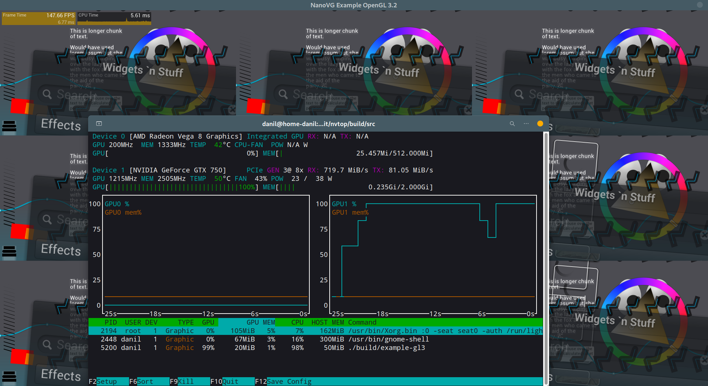
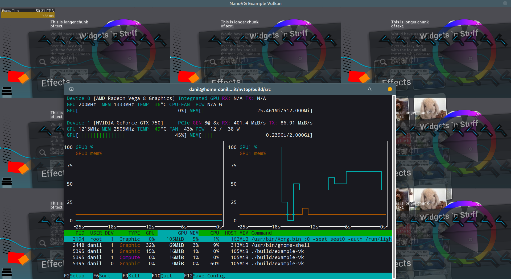
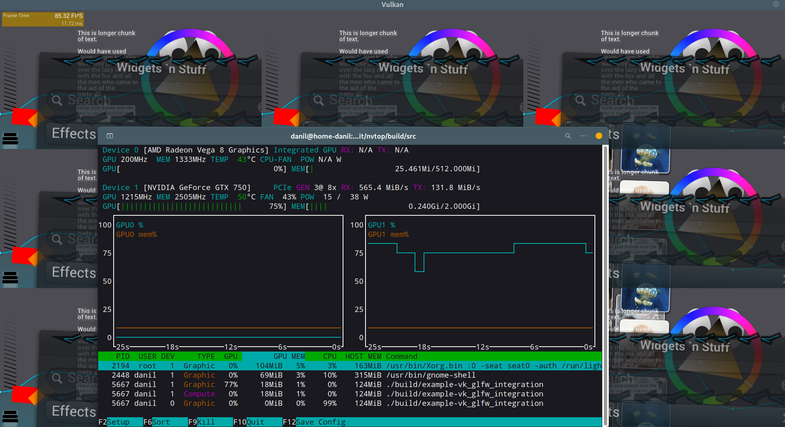
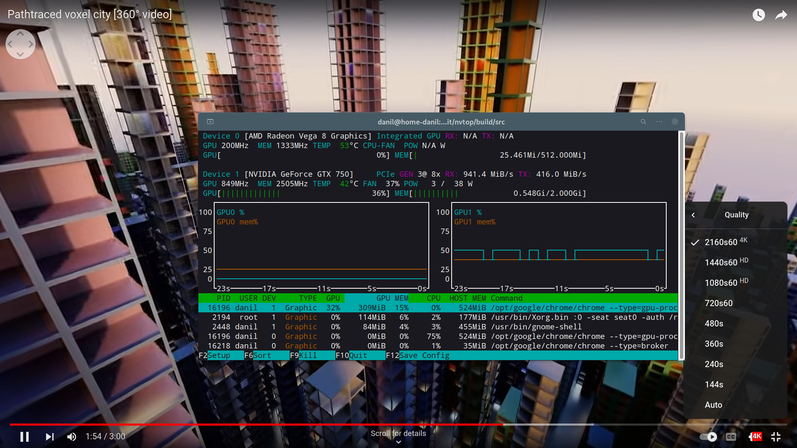
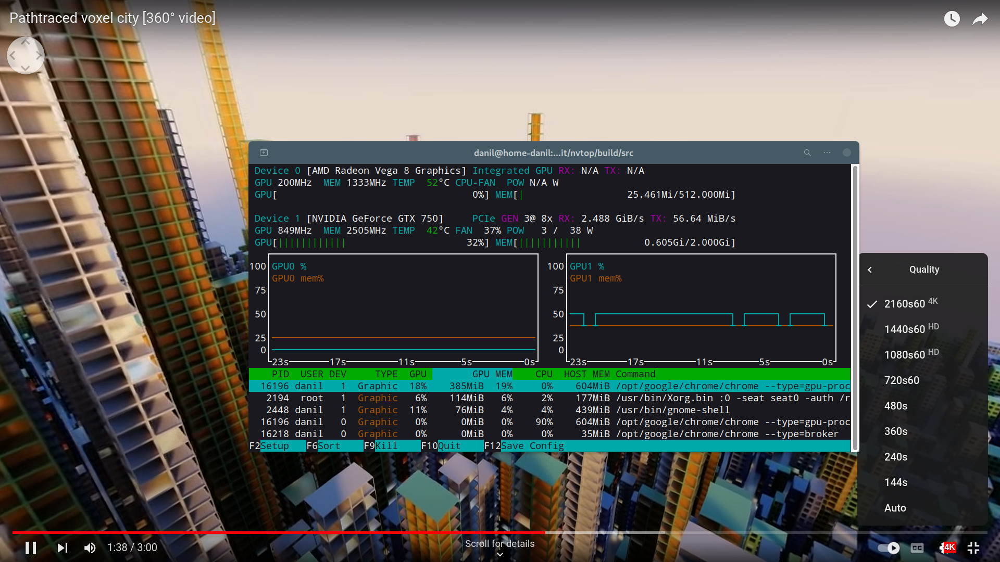
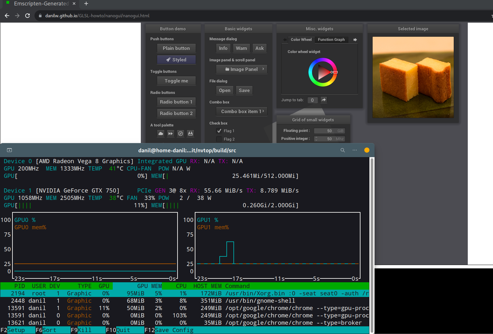
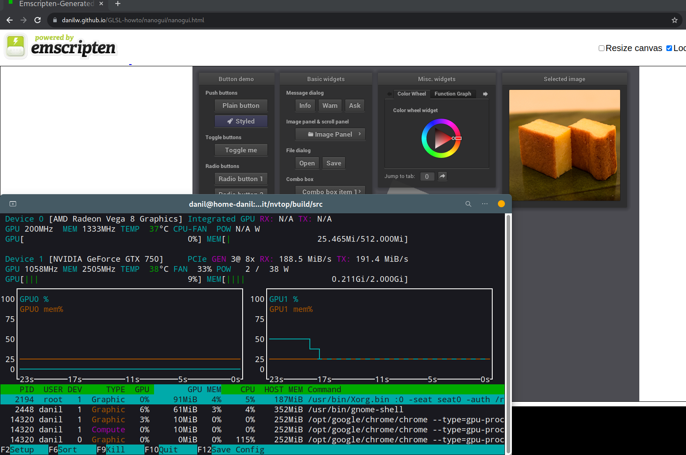

Investigating PCIE usage in nanovg_vulkan
========================

**Conversation start in this comment** - https://github.com/memononen/nanovg/issues/614#issuecomment-1426496757

**nanovg** - https://github.com/danilw/nanovg_vulkan

Main point:
=============

> Does nanovg_vulkan slowdown come from PCIE bottleneck, because some memory flag set incorrectly in source code or something related to memory speed.

### Result of this statistic:

*if tools to meassure performance is correct, and I not misinterpret results*

**PCIE is not bottleneck for nanovg_vulkan.**\
And PCIE usage by nanovg_vulkan is far from even 50% of PCIE bandwidth on this Nvidia GPU.

Information:
=============

I use nvtop to display GPU statistics - https://github.com/Syllo/nvtop

___

### In my test - Nvidia GPU set/used as main GPU in bios settings.

When Integrated GPU set to main - result of Nvtop is flooded with "frame copy from GPU to RAM".

**Screenshots:**

- When *Integrated GPU is main* - [1.5GiB+ goes just to transfer 170FPS to RAM](Vk_fps_nv_sec.png). *On screenshot right bot number is FPS*.

- Compare to *Nvidia is main GPU* - [no overhead, ~10MiB RX / ~2MiB TX  on 400FPS](Vk_fps_nv_main.png). *On screenshot right bot number is FPS*

Screenshots from [my shader-launcher](https://github.com/danilw/vulkan-shader-launcher) *example_minimal press 1 key to see fps, and launch with `--present_mode 0 --gpu 0` and change gpu index*, not from Khronos Vulkan Samples because multiple GPU support broken there.

___

Vulkan vs OpenGL PCIE usage in nanovg:
=============

| Render | FPS | PCI-E RX | PCI-E TX | Screenshot |
|-------------|------------|------------|------------|------------|
| OpenGL | 147 | 719MiB | 81MiB |  |
| Vulkan **1 frame in flight** | 50 | 401MiB | 86MiB |  |
| Vulkan **2 frame in flight** | 85 | 565MiB | 131MiB |  |

*Vulkan performance and PCIE usage for 3+ frames in flight is same as with 2.*

___

How peak of PCIE bandwidth usage look on this Nvidia GPU:
=============

Youtube video player use WebGL to play "panorama/360°"-videos.

I open my video *in 4k resoltion* - [Pathtraced voxel city [360° video] Youtbe link](https://youtu.be/Q2flsB-cQCo)

Video played in Chrome that use OpenGL as WebGL render, **this video play on 60fps with no lags when in 4k**.\
`chrome.exe --use-angle=gl`\
*because Vulkan WebGL Chrome render is more than 10x slower compare to OpenGL, and 4k video lags in Vulkan in Chrome, look below where I talk about Vulkan WebGL*

**Screenshot with TX: 400MiB**

**Screenshot with RX: 2.48GiB**

**That means nanovg_vulkan does not even go to 50% of PCIE usage.**\
While this video playing - RX jump around 1-2GiB, and TX is 50-400MiB.

___

WebGL with Vulkan in Chrome:
=============

Use Vulkan in Chrome - it is "very bad user experience".\
`chrome.exe --use-angle=vulkan`

**Even empty single triangle in WebGL will lag in full-screen when Chrome used with Vulkan.**\
Any Youtube video will also lag in fullscreen.\
By **lag** - I mean **FPS will be less than 30**.\
Anything that larger than 1280x720 as video or single canvas or WebGL element - will drop FPS from 60 to lower nmber.

*Only use of Vulkan in Chrome is - you can select GPU to use, when in OpenGL Chrome will always use only "main" GPU.*\
*When you have multiple GPU, or even simple integrated+discrete - Vulkan is useful in Chrome, even when it so much slower than OpenGL.*

### Screenshots below show PCIE usage in WebGL when it use OpenGL and Vulkan.

*I use NanoGUI WebGL port as example, because NanoGUI use nanovg so it can be related* - [nanogui WebGL link](https://danilw.github.io/GLSL-howto/nanogui/nanogui.html)

Main point here is - **very high PCIE usage in Vulkan compare to OpenGL**.\
*This size of canvas still work in 60 FPS in Vulkan, but in fullscreen it is slideshow - obviously Chrome issue/bug.*

WebGL in ***OpenGL* screenshot**:\
**RX: 55MiB TX: 9MiB**

WebGL in ***Vulkan* screenshot**:\
**RX: 180MiB TX: 190MiB**

___
