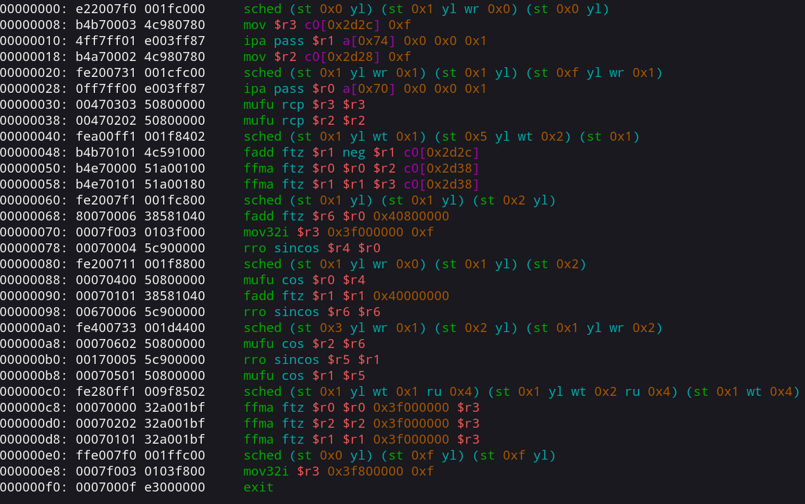
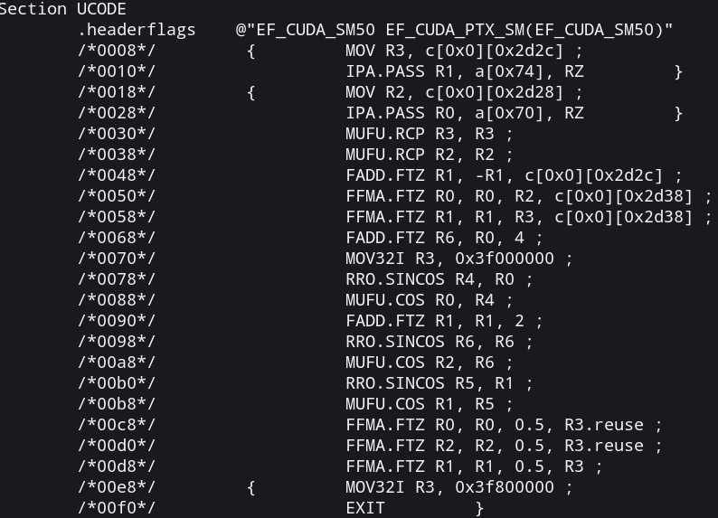
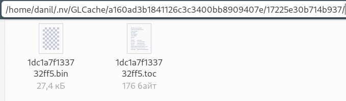
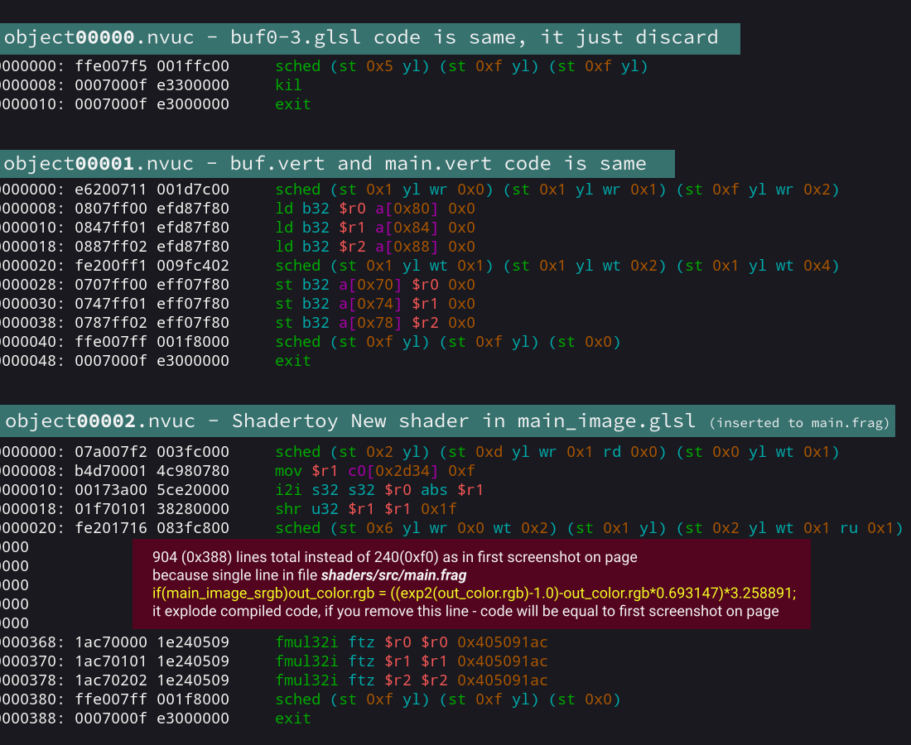
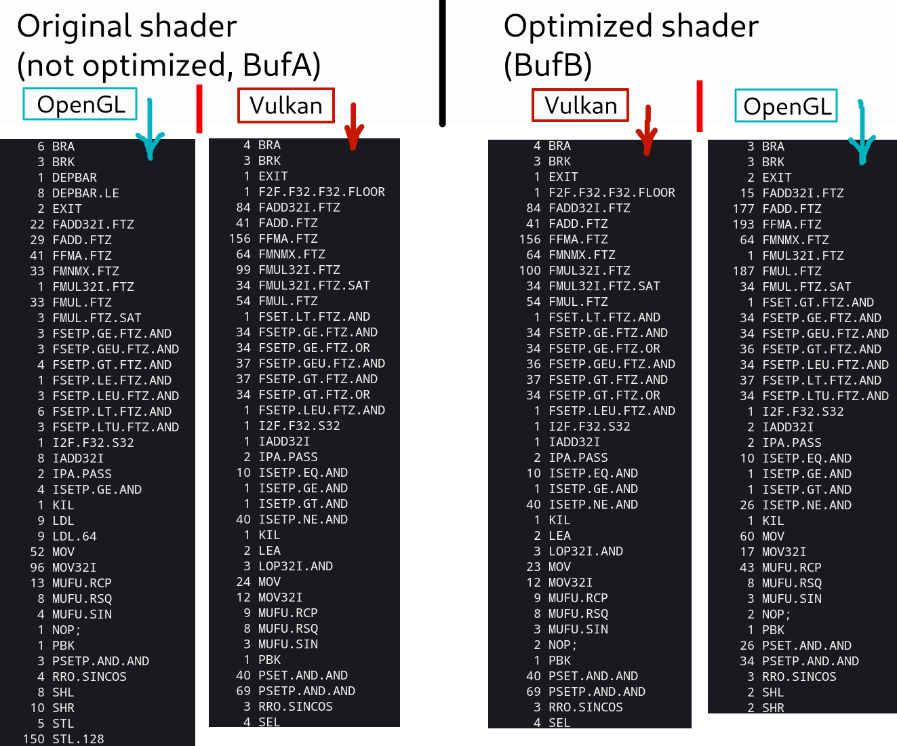
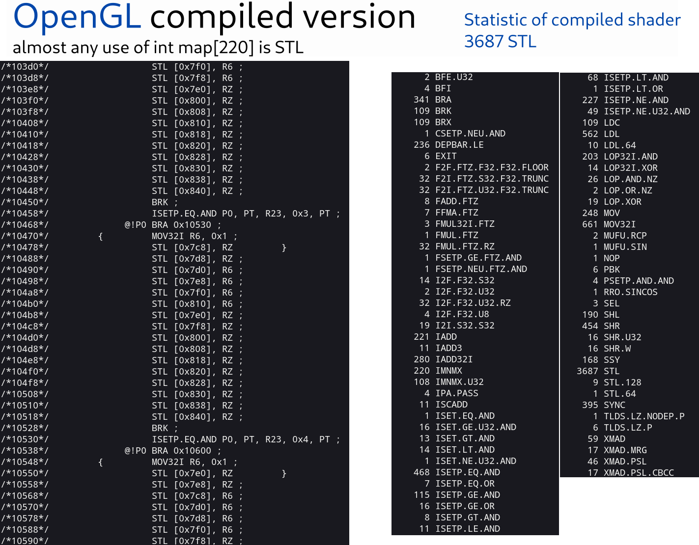
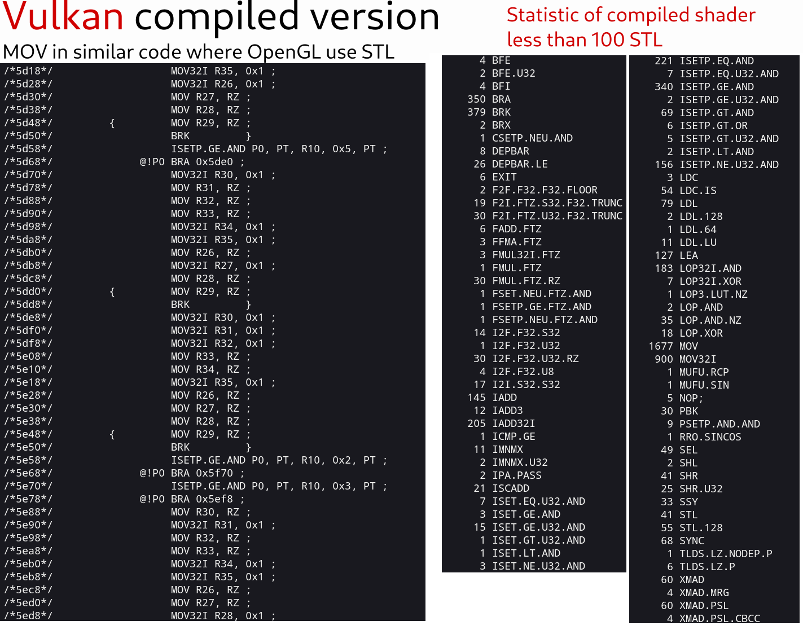
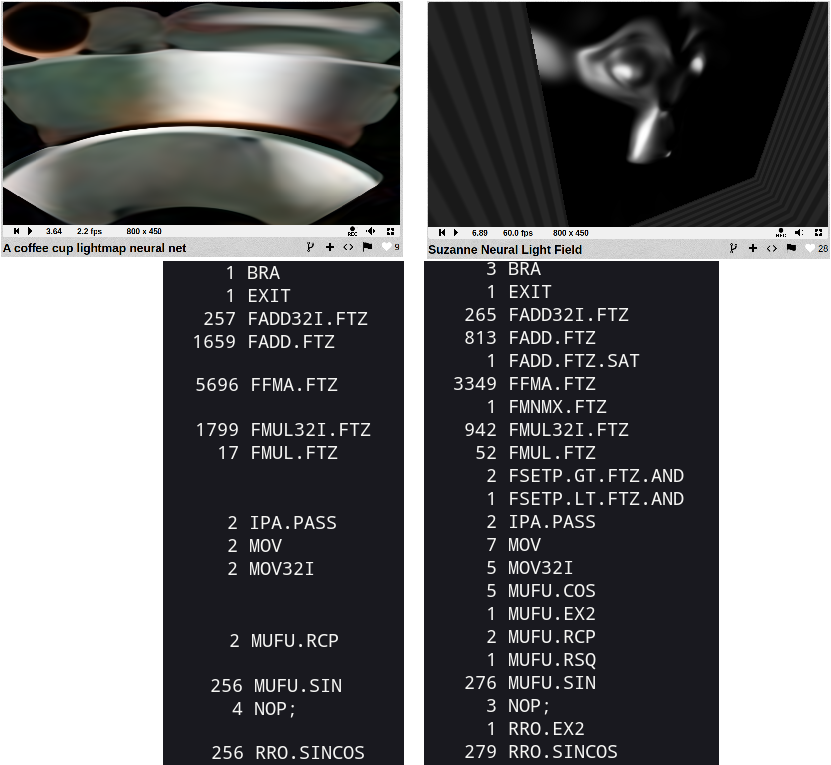
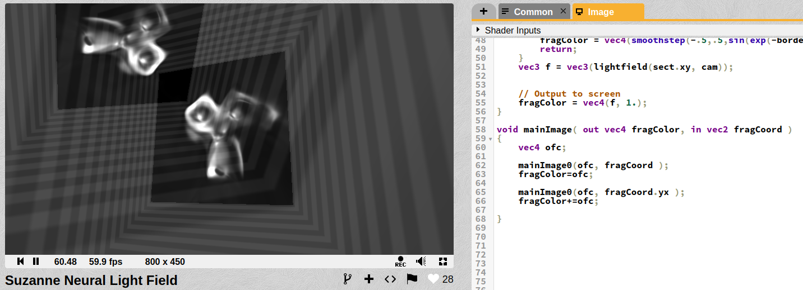
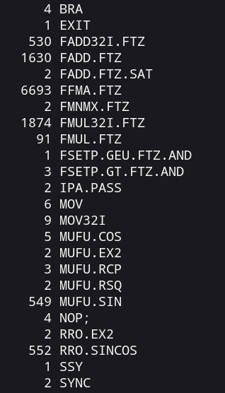

Decompiling Nvidia shaders, and optimizing
==========================================

Nvidia instructions for Shadertoy New shader, envydis output

About decompiling Nvidia OpenGL and Vulkan fragment shaders.

Main tool to make it work - [nvcachetools](https://github.com/therontarigo/nvcachetools) made by [Theron Tarigo](https://github.com/therontarigo).

This is my tutorial/note for Linux, but it works very similar way on Windows, look [nvcachetools github page](https://github.com/therontarigo/nvcachetools) to see more info about using it on other OS.

Look *example-usage* and *shader-optimization* at the end.

> [nvcachetools](https://github.com/therontarigo/nvcachetools) --- It extracts shaders from specificied cache toc file, normally in `$HOME/.nv/GLCache/` Nvidia driver puts shaders here regardless of API, both Vulkan and OpenGL.\
> Shader can be decompiled with [nvdisasm](https://docs.nvidia.com/cuda/cuda-binary-utilities/index.html#nvdisasm) ( - binary option) or with this open-source disassembler [envytools](https://envytools.readthedocs.io/en/latest/envydis/index.html) if you have Maxwell or one of the older GPU it supports.

Detailed instruction and example use cases below.

Tools
=====

1.  Build [nvcachetools](https://github.com/therontarigo/nvcachetools).
2.  Build [envytools](https://github.com/envytools/envytools/).\
    Non opensource alternative, proprietary software made by Nvidia --- install CUDA *or* download [cuda-nvdisasm](https://developer.download.nvidia.com/compute/cuda/repos/rhel9/x86_64/cuda-nvdisasm-11-7-11.7.91-1.x86_64.rpm) and extract nvdisasm file.

Short instruction
=================

1.  `./nvcachedec nv_bin/*.toc objs`
2.  `./nvucdump objs/object00000.nvuc sections`\
    or `object00001.nvuc` or other number\
    Look *Advanced usage --- File names* below.
3.  `./envydis -i -mgm107 sections/section4_0001.bin`\
    or `/usr/local/cuda-11.8/bin/nvdisasm --binary SM87 objs/object00000.nvuc`

nvdisasm output for Shadertoy New shader

Instruction
===========

Get compiled shaders from shader cache.
---------------------------------------

Default location for shader cache: `~/.nv/GLCache`

For example --- delete everything from "default shader cache" and run your OpenGL or Vulkan application.\
If there appears a new folder --- this is your compiled shaders.

*Applications like Google Chrome use custom location of cache and encrypt it, so it is unusable.* Use minimal launchers.\
I have only Vulkan launcher --- [Vulkan-shadertoy-launcher](https://github.com/danilw/vulkan-shadertoy-launcher). (for OpenGL you have to look for something minimal)

Files you need is `*.bin` and `*.toc` files with same name.\
Every unique name of file is all shaders for this application.

Example of single application compiled shaders, after launching this app.

Copy `*.bin` and `*.toc` files to a new folder `nv_bin` folder location at `nvcachedec` file, just to have result from this single application.

And use `nvcachedec`to decompile.\
Then call `nvucdump` to extract sections.\
Then `envydis` with parameters, parameters can be found on [*envydis and envyas documentation*](https://envytools.readthedocs.io/en/latest/envydis/index.html#using-envydis-and-envyas) page.\
Or use`nvdisasm` options can be found on [*nvidia docs portal*](https://docs.nvidia.com/cuda/cuda-binary-utilities/index.html#nvdisasm-options).

Advanced usage
==============

Instruction Set Reference:
--------------------------

-   official [Nvidia docs link](https://docs.nvidia.com/cuda/cuda-binary-utilities/index.html#instruction-set-ref)
-   *envytools* documentation:\
    [nVidia hardware documentation](https://envytools.readthedocs.io/en/latest/hw/index.html) --- Fermi or Maxwell sections\
    [falcon microprocessor](https://envytools.readthedocs.io/en/latest/hw/falcon/index.html) section has more information than others

To calculate number of instructions:
------------------------------------

From `nvdisasm` output.\
Visual result of this command --- on screenshots below with statistic number of instructions per shader.

`/usr/local/cuda-11.8/bin/nvdisasm --print-code --binary SM87 objs/object00000.nvuc | sed '1d' | sed -e 's/@[!|A-Za-z0-9]* / /g' | perl -p0 -e 's#/\*.*?\*/##sg' | sed "s/^[{|}| \t]*//" | sed 's/\s.*$//' | sort | uniq -c`

File names to shader names
==========================

In case of using my [Vulkan-shadertoy-launcher](https://github.com/danilw/vulkan-shadertoy-launcher)\
File names for command `./nvucdump objs/object<NUMBERS>.nvuc sections`\
Or/and for `nvdisasm` command

Only when code in each shader is unique:
----------------------------------------

-   `object00000.nvuc` is `shaders/shadertoy/buf0.glsl`
-   `object00001.nvuc` is `shaders/src/buf.vert`
-   `object00002.nvuc` is `shaders/shadertoy/buf1.glsl`
-   `object00003.nvuc` is `shaders/shadertoy/buf2.glsl`
-   `object00004.nvuc` is `shaders/shadertoy/buf3.glsl`
-   `object00005.nvuc` is `shaders/shadertoy/main_image.glsl`
-   `object00006.nvuc` is `shaders/src/main.vert`

*But when shader code is the same* --- shaders will be compiled into a single `*.nvuc` file.

For example, in download [*vulkan-shadertoy-launcher_linux.zip*](https://github.com/danilw/vulkan-shadertoy-launcher/releases) used [*this shadertoy shader*](https://www.shadertoy.com/view/WlcBWr).\
Every Buffer shader and Image shader in this Shadertoy *is unique *---* file order will follow my listed order above*.*\
*Except two Vertex shaders `buf.vert` and `main.vert` --- they will both be in the `object00001.nvuc` file.

And for [*empty_template_shadertoy.zip*](https://github.com/danilw/vulkan-shadertoy-launcher/releases) that use only "New Shadertoy shader" in Image shader.\
Shader code in `buf0-3.glsl` and Vertex shaders is same.\
This why it will be just 3 `*.nvuc`files, look screenshot:

3 decompiled *.nvuc files from empty-template where 4 buffers is just discard, Vertex shader, and image shader is simple New Shader code.

*I'm not sure why file names like this. (no idea)*\
in OpenGL file name order depends on application, and sometimes there are huge gaps in names.\
I saw --- `objs/object00016.nvuc` was my first fragment shader, and then `objs/object00019.nvuc` is second fragment shader, when files `00017-18` not exist, and many similar "gaps" in file names.

Example usage
=============

To see source of major slowdown in shaders:
===========================================

Major slowdown in shader can come from `STL` --- Store to Local Memory instruction, this mostly used by large arrays in shaders, and/or when arrays copy itself as argument.

And decompiling compiled binary shader, you can see the number of `STL` calls in compiled code:

Original vs optimized shader

This test shader from screenshot ---[ Shadertoy link STL slowdown](https://www.shadertoy.com/view/cdB3WG).\
This bug/slowdown works only on Nvidia in OpenGL.

*STL optimization in linked above shader made by *[*Theron Tarigo*](https://github.com/therontarigo)*.*

Comparing same GLSL-code shader compiled in OpenGL and Vulkan:
==============================================================

In Nvidia case --- OpenGL shader compiler in Nvidia driver *can be* much worse than shader compiler for Vulkan in driver. Nvidia has a lot of OpenGL only bugs, [my list of bugs](https://github.com/danilw/GPU-my-list-of-bugs) list some OpenGL only bugs.

Shader from screenshot above (with STL slowdown) works perfectly fine and same fast (as its optimized version) on Nvidia in Vulkan, so --- let's see compiled code of this same shader in Vulkan:

Comparing two shaders compiled in Vulkan and OpenGL

This test shader from screenshot --- [Shadertoy link STL slowdown](https://www.shadertoy.com/view/cdB3WG).

It's clear that *only OpenGL not optimized shader* use STL.

Vulkan code almost same for both shaders, maybe because glslangValidator optimize shader code, so optimization of *not-optimized* shader happened on glslangValidator side.

Compiled code of optimized version of shader in Vulkan and OpenGL is different.

STL is Always bad! (smaller arrays and less array read/write is always better)
----------------------------------------------------------------

*But STL not always bad! (not always the main source of slowdown)*

**Update 2024** -  STL is always bad, but only on Nvidia.\
*I tested [stl-slowdown shader](https://www.shadertoy.com/view/cdB3WG) on Nvidia 4060 RTX - and it show 2fps on STL side.*

Remember that if you have huge-shader with lots of branches and use arrays --- because in shader everything unrolled you can have thousands of STL as result, but shader will work very fast.

Example of shader like this and to test---my shader [GLSL Auto Tetris](https://www.shadertoy.com/view/3dlSzs).\
On screenshots below --- shader from BufA when AI works(`#define no_AI` not set)

OpenGL statistic of shader in BufA

Vulkan statistic of same shader

OpenGL version use 3600+ STL instructions, but shader works same fast in OpenGL and Vulkan (very similar FPS, even on low-end Nvidia GPU).

*In this case, STL does not have huge impact on performance. (**I not 100% sure in this case, but STL do impact performance even in this large shader**)*

Optimization of this my [GLSL Auto Tetris](https://www.shadertoy.com/view/3dlSzs) shader:
-----------------------------------------------------------------------------------------

Main performance speedup is --- switching from using `int[220]` array to `uint[7]` .\
I use `int[220]` to store 220 bits, so *seven uints* is enough to store it.

Look Common on linked Shadertoy shader --- line 11 `#define use_uint_map`\
*Uncomment this define to use new map.*

I see about 5x speedup *(in OpenGL)* --- if you set `#define AI 0` in Common to test maximum shader load.\
*In Vulkan --- I think about ~2 times faster from using smaller array.*

Analyze and optimize neural(ML) shaders:
========================================

This shader ---[ A coffee cup lightmap neural net](https://www.shadertoy.com/view/fl3BWB) works for me (on Nvidia) with 2--5 FPS in preview 800x450. *(yes its because I use low-end Nvidia GPU, on AMD GPU or better Nvidia this shader works also fast)*

When this other very similar by amount of data shader --- [Suzanne Neural Light Field](https://www.shadertoy.com/view/wlyczt) works with 60 FPS even in 1080p fullscreen.

Let's compare.\
*(I'm comparing only in Vulkan, it works with same FPS for me in Vk and OGL)*

Statistic of instructions in each shader

From this I can assume:
-----------------------

-   This is not because sin/cos instruction, same number of sin/cos in both shaders.
-   Uses of FFMAFP32 ---* Fused Multiply and Add* instructions about 2x more in first shader.

So this means --- if I just "run the second shader twice" ([*Suzanne Neural Light Field*](https://www.shadertoy.com/view/wlyczt) shader) performance of shader will drop to 2--4FPS same as firs shader...\
Let's test:

Rename original mainImage to mainImage0 and run it twice --- I have two monkeys.

Still 60 FPS\
Compiled code:

2x of everything

Almost everything multiplied by two, even sin/cos run twice, but performance does not drop at all.\
Still 60 FPS, when first shader (*A coffee cup lightmap neural net*) has very slow performance 2--4 fps in preview with same number of instructions.

Only difference left between those two shaders --- is the amount of internal data in those mat4 constants.

[A coffee cup lightmap neural net](https://www.shadertoy.com/view/fl3BWB) --- use 7x8x8 ([this Jure Triglav blog](https://juretriglav.si/compressing-global-illumination-with-neural-networks/) explains some of it) is 448 of mat4 ---* 28 Kbyte of data*. (actually stored `0x1ef4` bytes or 7 Kbyte)

[Suzanne Neural Light Field](https://www.shadertoy.com/view/wlyczt) --- use 16x16 model that 256 mat4 constants in shader code or *16 Kbyte of data* in constants. (actually stored `0x43c` bytes or about 1 Kbyte)

Section CONST in `nvdisasm` output

I think my GPU performance problem --- is "too many constants".

My conclusion out of all this --- around One or Two Kbyte of CONST is limit for "good performance" for this my Nvidia GPU.
------------------------------------------------------------------------------------------------------------------------

1 Kbyte is 256 unique float values.

My try to fix this:
-------------------

I have an obvious and simple idea --- convert each of "unique floats" to some limit range and then replace original value by "compressed".\
This simple python script [*cfloats.py*](https://gist.github.com/danilw/c9cf7d1c630ca1ad1da10b9efc4621bd) used to process floats.

Result:
=======

[Optimized ML/Neural shader](https://www.shadertoy.com/view/dd23Dc)

I got 60 FPS in 800x450 preview and 30 fps in fullscreen, from original 2--4 fps in preview and 0 on 1080p fullscreen.

Optimization --- just replacing float constants in code to some other float, like `0.011` and `0.012` become single `0.011` to use less space in CONST memory.

Final optimized shader --- [Optimized ML/Neural shader](https://www.shadertoy.com/view/dd23Dc).
---------------------------------------------------------------------------------------------

For this shader I used `b_scale = 132.0` in [*cfloats.py*](https://gist.github.com/danilw/c9cf7d1c630ca1ad1da10b9efc4621bd) python script to scale floats.

I tested with smaller values, and bigger --- with even 1/64 or 1/32 as float step performance almost same as with 120--150(`b_scale`). When `b_scale` is 180+ it drop to 30 fps on preview.\
Look like when CONST size hit 3 Kbyte+ my Nvidia GPU gets much slower compare to 1--2 Kbyte of CONST.

Yes there are some quality loss:
--------------------------------

[Optimized ML/Neural shader](https://www.shadertoy.com/view/dd23Dc)

I think it can be used to optimize ML/Neural shaders for low-end hardware.\
Like old GPUs that still support modern graphic API but they become way too slow to process modern amount of data.

Enjoy debugging xD
