# my-shader-templates-list

**what is it** - tools-templates like code free for use, mit or no license. 

Most of listed here can be very useful in Shadertoy-development, most of my shaders started from this templates.

### Contact: [**Join discord server**](https://discord.gg/JKyqWgt)
___

More links and shader related stuff - in my blog [medium link](https://arugl.medium.com/) or [github mirror](https://github.com/danilw/danilw.github.io/tree/master/blog).

### And remember about most useful - **[iquilezles articles and portal](https://iquilezles.org/articles/)**
___

| Screenshot | link |
|-------------|------------|
| --- | --- |
| Useful | --- |
| 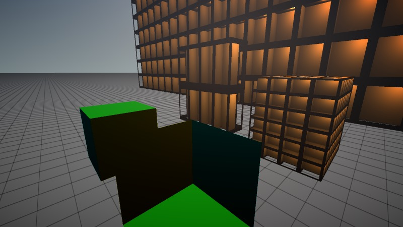 | [TEMPLATE 3d intersection](https://www.shadertoy.com/view/sltyR2) |
| 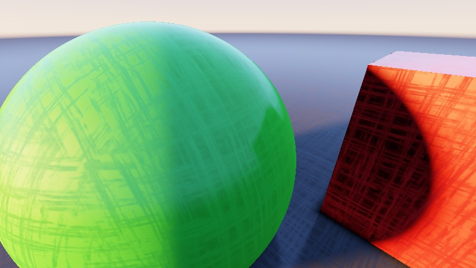 | [TEMPLATE 3d sdf raymarch](https://www.shadertoy.com/view/DljGzy) |
| 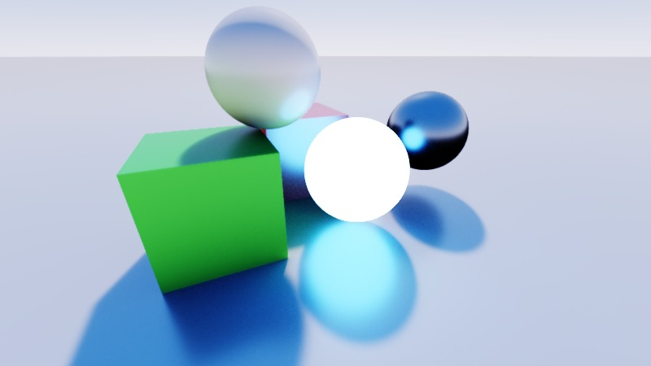 | [TEMPLATE 3d pathtracer TAA](https://www.shadertoy.com/view/dldGWj) |
| 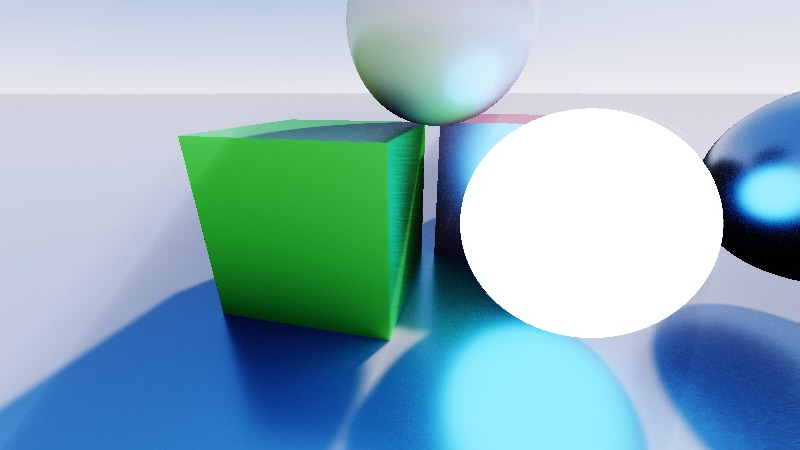 | [TEMPLATE 3d pathtracer NO TAA](https://www.shadertoy.com/view/fsyBRW) - less complex to use in Shadertoy |
| 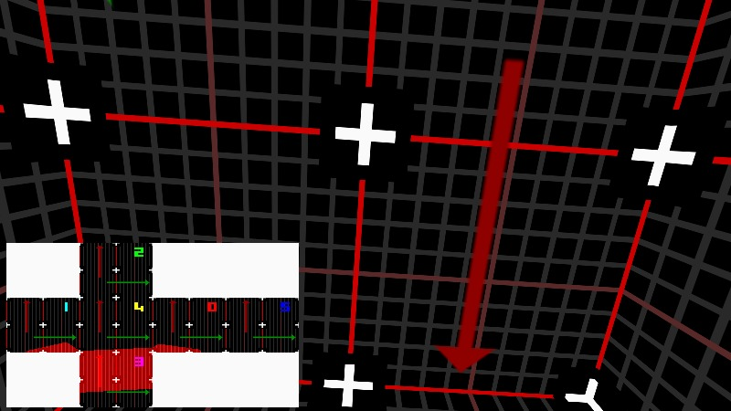 | [TEMPLATE cubemap tools](https://www.shadertoy.com/view/NttGWr) - extremely useful. Panorama/cubemap uv mapping from-to-from all directions.|
| 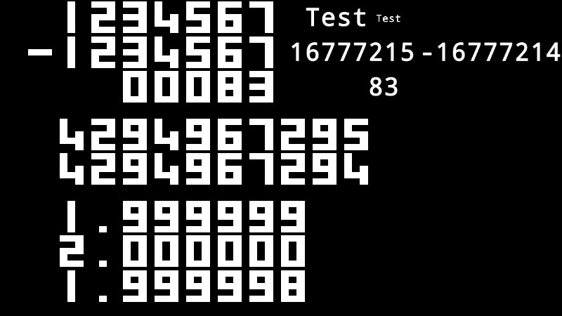 | [TEMPLATE PRINT text uint float](https://www.shadertoy.com/view/DsffW8) |
| 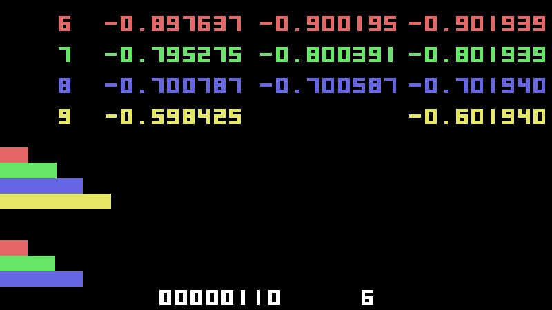 | [TEMPLATE pack unpack bits](https://www.shadertoy.com/view/Nls3Rn) - extremely useful. |
| 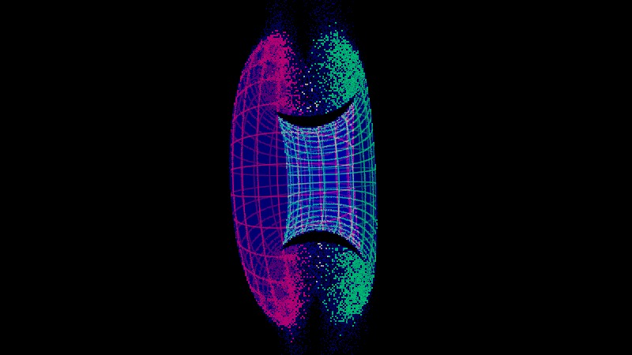 | [TEMPLATE double Vulkan FP64 bits](https://www.shadertoy.com/view/7sdyz2) |
| 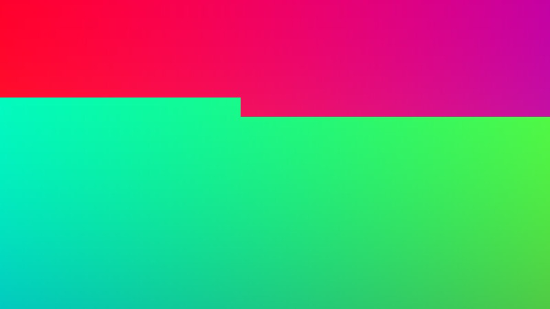 | [TEMPLATE tile rendering example](https://www.shadertoy.com/view/tltBzM) - minimal example of tile rendering for Shadertoy, for heavy shaders. |
| 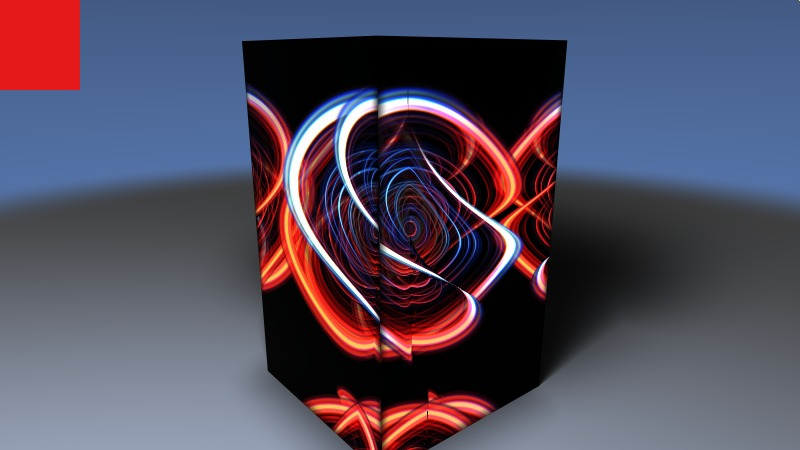 | [TEMPLATE 64x64 tile render](https://www.shadertoy.com/view/7ldXzf) - more complex tile rendering. |
| --- | --- |
| less often used | --- |
| 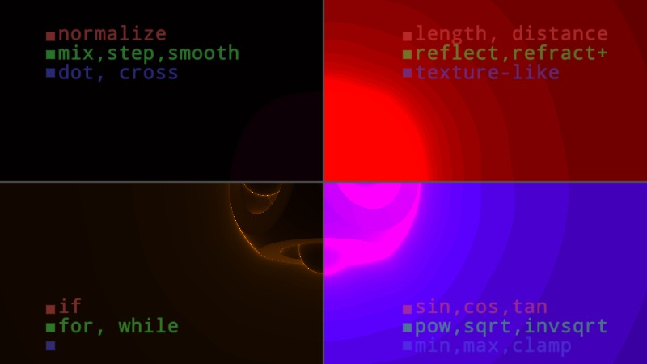 | [Debug heatmap script](https://www.shadertoy.com/view/tllfDM) - not very very useful/helpful, but can be used to "see" what function called the most in shaders. |
| 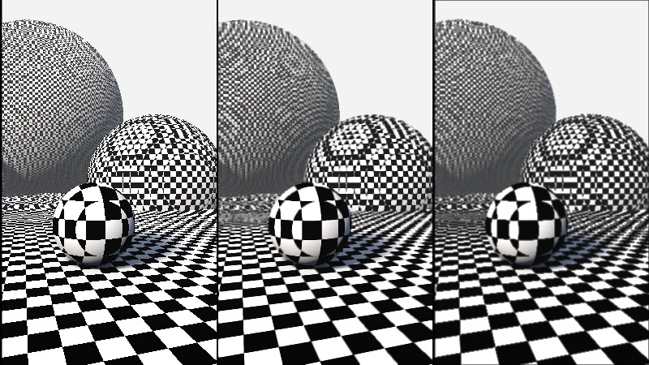 | [TEMPLATE TAA filter antialiasing](https://www.shadertoy.com/view/sljyRy) - notice link to TAA-for geometry edges in shader description. |
|  | [TEMPLATE DEBUG](https://www.shadertoy.com/view/WlcBWr) - for debug/compare Shadertoy behavior outside of Shadertoy. |
| 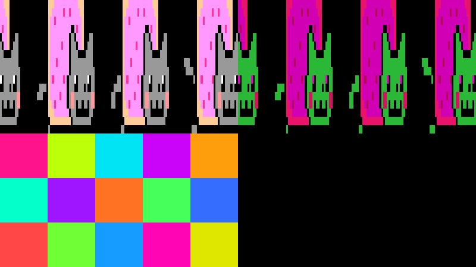 | [TEMPLATE color palette](https://www.shadertoy.com/view/ttjSD1) |
| 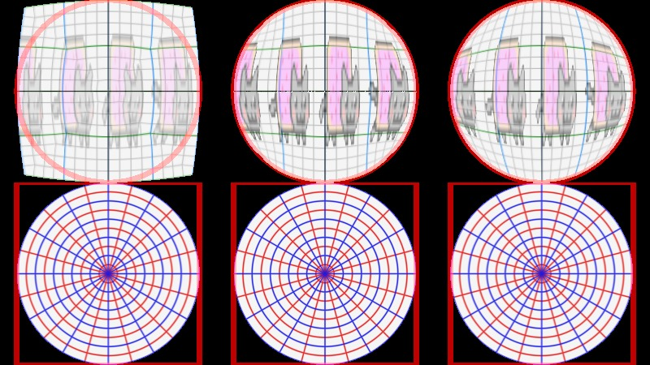 | [disk/square mapping](https://www.shadertoy.com/view/wdBXRt) |
|  | [Reprojection UV Screen-Quad UV](https://www.shadertoy.com/view/tdyBRz) |
| 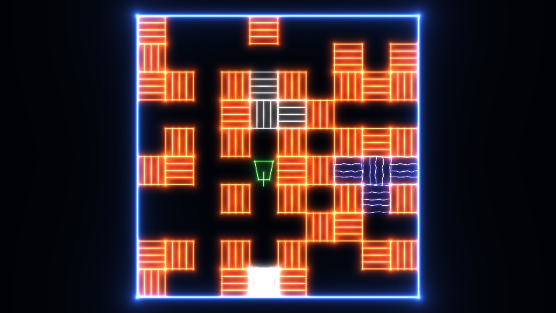 | [mini game engine](https://www.shadertoy.com/view/wdS3D3) |
| 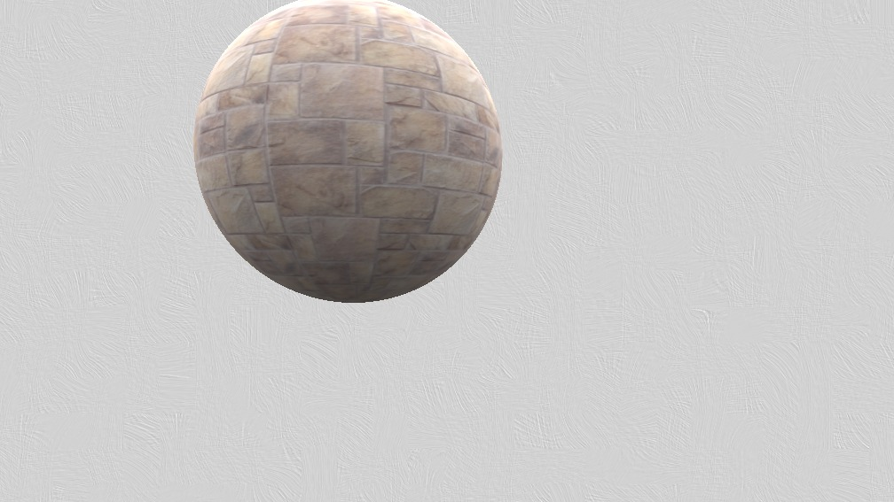 | [Transparent background for Shadertoy shader](https://www.shadertoy.com/view/XljSRK) |
| --- | --- |
| Noise note | --- |
| 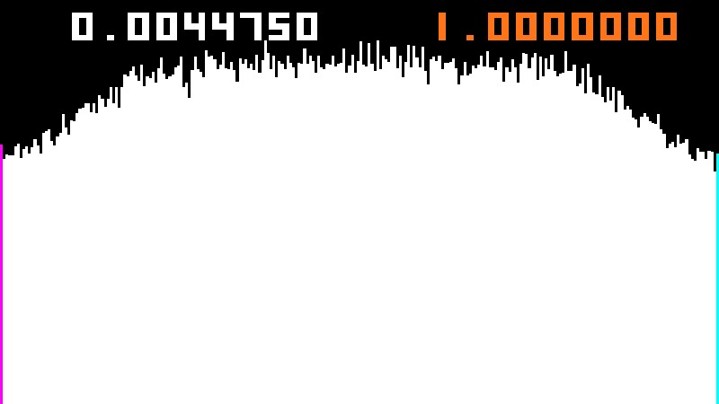 | [distribut value noise, histogram](https://www.shadertoy.com/view/7syfRd) |
| 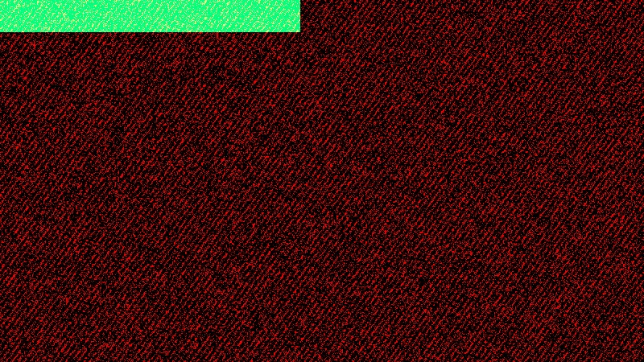 | [TEST noise hash repetition](https://www.shadertoy.com/view/NdGfRd) |
| --- | --- |
| Const data note | --- |
| 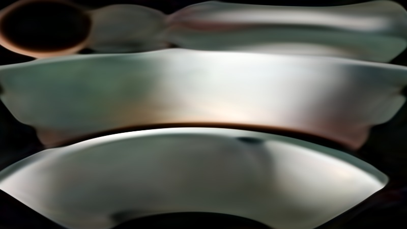 | [Optimized ML/Neural shader](https://www.shadertoy.com/view/dd23Dc) - remember about const data size in shader. |

