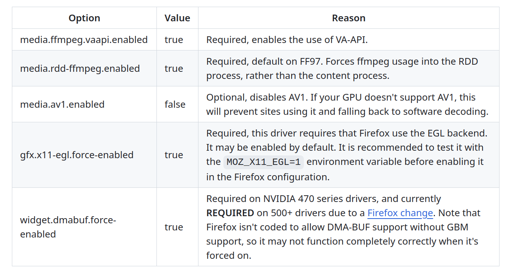
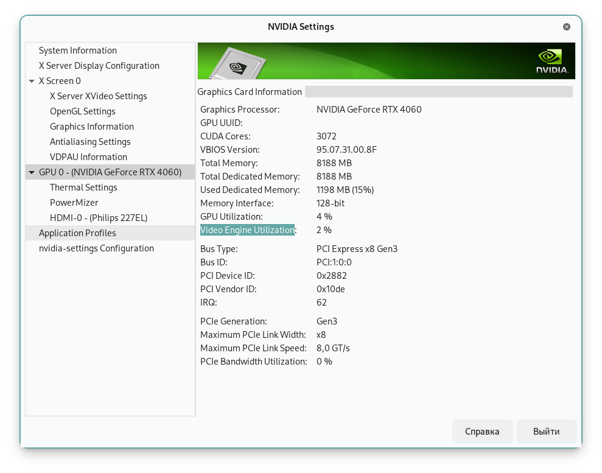
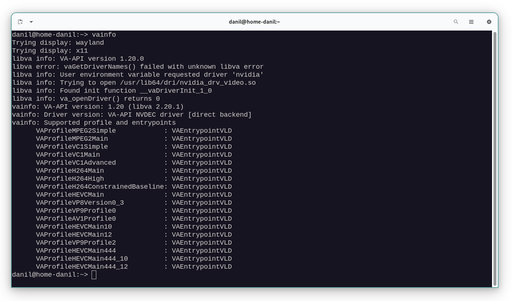
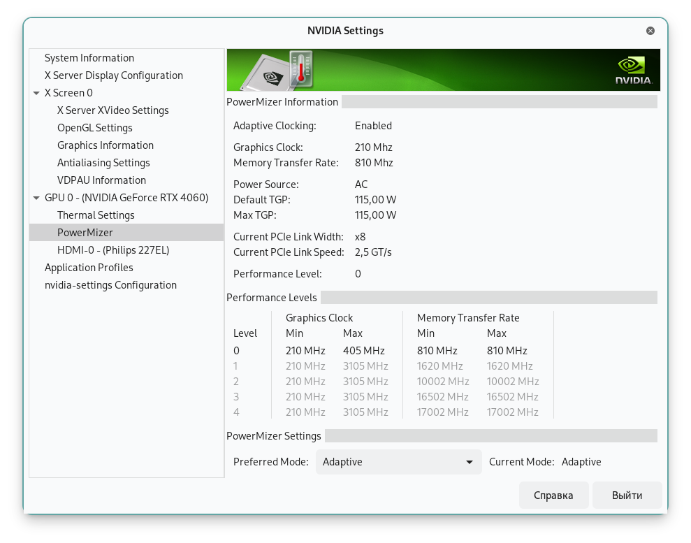

* * * * *

# Nvidia Linux GPU video decoding-acceleration in webbrowsers - does it work, and is it worth it


___

## Does it work, in webbrowser:

Yes. **Only in Firefox.**

Go to [nvidia-vaapi-driver](https://github.com/elFarto/nvidia-vaapi-driver) - build and install it, and follow instruction to make hardware video acceleration work.

___

## Update Novemnber 2025 - to context with "force P2 state":

[Nvidia driver: 580.105.08](https://www.nvidia.com/en-us/drivers/details/257493/) 

> Added a new environment variable, `CUDA_DISABLE_PERF_BOOST`, to allow for disabling the default behavior of boosting the GPU to a higher power state when running CUDA applications. Setting this environment variable to `1` will disable the boost. 

*For more details read [this comment](https://github.com/NVIDIA/open-gpu-kernel-modules/issues/333#issuecomment-3499129176).*

___


## Short insrtuction to `nvidia-vaapi-driver`:

1. `git clone https://github.com/elFarto/nvidia-vaapi-driver`
2. Install in your package manager, names in OpenSuSe package manager:\
    `meson` and `ffnvcodec-devel` and `gstreamer-plugins-bad` and `streamer-plugins-bad-devel`
4. In *nvidia-vaapi-driver* directory - `meson setup build` and `meson install -C build` - to install you need root password.
5. Add to boot parameters to kernel `nvidia-drm.modeset=1`, in OpenSuSe it - `/sbin/yast2 bootloader` second tab "kernel parameters" and aditional parameters line there.
6. Environment Variables - edit `~/.profile` text file, add: *(notice new `CUDA_DISABLE_PERF_BOOST=1` added to fix force P2 state)*

```
export NVD_BACKEND=direct
export LIBVA_DRIVER_NAME=nvidia

export MOZ_X11_EGL=1
export MOZ_DISABLE_RDD_SANDBOX=1
export CUDA_DISABLE_PERF_BOOST=1
```

7. Firefox - open in Firefox page `about:config` and follow:

8. It should work, to confirm - look `nvidia-settings`, and to know *nvidia-vaapi-driver* works - `vainfo`, look my screenshot below.
9. For more information look oritinal instructions on https://github.com/elFarto/nvidia-vaapi-driver 

___

If you do everything correctly - when playing video in webbrowser youl see `Video Engine Utilization %`. 




For me - even vp8 and vp9 videos on youtube work with hardware-GPU decoding.



___

## Is it worth it:

**I noticed** - when GPU acceleration thru `nvidia-vaapi-driver` active in webbrowser - GPU forced to `GPU 2460MHz MEM 8250MHz`.\
When minimal `GPU 210MHz  MEM 405MHz`.



And when I play video in webbrowser on CPU-decoding, no GPU-acceleration - GPU stay on lowest level.

For this 4060 GPU - max power usage by GPU is 115Watt.\
Because GPU forced to P2 for CUDA-video-decoding, P2 is 40-60% power usage.\
Means GPU just wasting about 40Watt to decode video.

*Just waste* - I mean GPU boosted to 40-60% of performance and use 1-2% of this performance to actualy decode video, 1-2% you can see in `nvidia-settings`.

When CPU I use is 65Watt CPU and it uses 20% of performance to decode 720p-1080p videos.\
20% of 65Watt is 13Watt.

**Look like - it is cheaper to decode on CPU.**

And it confirmed not just by me, but by other user -  look [here](https://github.com/elFarto/nvidia-vaapi-driver/issues/74).\
*120W on CPU and 180W on GPU-acceleration.*

___

## Why Nvidia forced to P2 for video-acceleration:

Look [there](https://github.com/elFarto/nvidia-vaapi-driver/issues/279).\
Quote:

> nvdec requires cuda, and cuda forces the GPU into at least the P2 state, while the actually hardware decoding works fine at P5. Both VDPAU and Vulkan video decode demonstrate this - they use the same video decoding hardware but don't force the power state to increase.

___

## Conclusion:

**Update 2025** - since 580.105.08 there `CUDA_DISABLE_PERF_BOOST` to turn off force-behavior - **notice Update 2025 note at top.**\
**Since now - it worth it**.

*Below is only for old drivers.*

___

Use of Nvidia video-decoding hardware acceleration in Linux webbrowser is ~not worth it~.\
For reason - Nvidia force GPU-clocks/performance to P2.

For desktop-video players - like mpv - **maybe for 4k videos it worth it**.\
Because when I tested 4k video on CPU-decoding use about 60% of CPU performance, plus forced GPU to P1 I think because PCIE-speed-utilisation for 4k video.

*Obviously GPU-encoding worth using, it much faster on GPU to encode video, but GPU-video-decode is not.*

*Atleast until Nvidia add exception to not force P2 for video decode.*

___

P.S. For mpv video acceleration look [mpv hwdec](https://mpv.io/manual/master/#options-hwdec) parameter, can be saved to [~/.config/mpv/mpv.conf](https://mpv.io/manual/master/#files-~/-config/mpv/mpv-conf).\
By default mpv use CPU-decode, `hwdec=auto` and `vo=gpu` is enough to use GPU-video decode in mpv.
