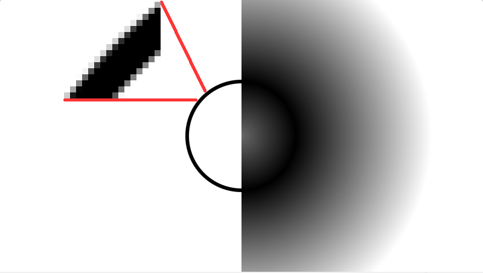
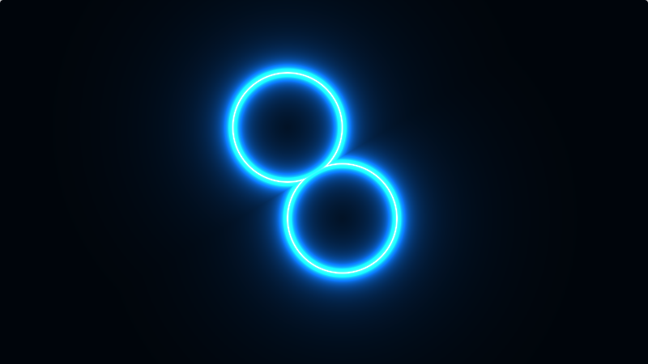
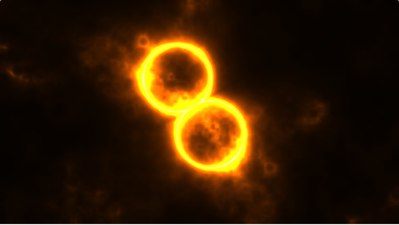
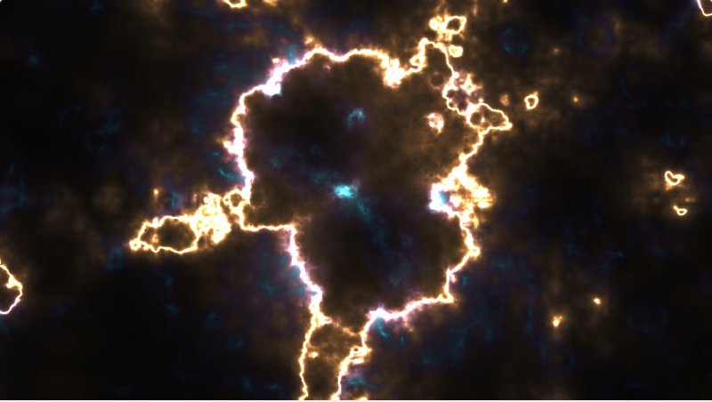

* * * * *

## Simple SDF tutorial

**Better tutorial, or watch first** - [Inigo Quilez
The basics of Painting with Maths](https://youtu.be/0ifChJ0nJfM)

This my tutorial shows how to use SDF shape to create some basic effect.

___


Link to external blog post-tutorial, **read it first if you do not know what SDF is** - [https://www.ronja-tutorials.com/post/035-2d-sdf-combination/](https://www.ronja-tutorials.com/post/035-2d-sdf-combination/#simple-combinations)

Look there for *Simple Combinations* such as - merge, intersect, subtract, and others.

Down below I use **merge operation**, that literally just `min(shape1, shape2);` so I use directly `min`.

This page has list of **more basic SDF shapes**, I use just Circle [2D distance functions](https://iquilezles.org/articles/distfunctions2d/)

**Content**:

1. SDF of Circle and Circle
2. Two circles
3. Glow edge
4. Adding Noise glow
5. Animating everything (**final effect** with shadertoy link)

___

Copy-paste shader code to [Shadertoy.com](https://www.shadertoy.com/)
___

##SDF of Circle and Circle:


Basic SDF
```c
float sdCircle( vec2 p, float r )
{
    return length(p) - r;
}

void mainImage( out vec4 fragColor, in vec2 fragCoord )
{
    
    vec2 res = iResolution.xy/iResolution.y;
    vec2 uv = fragCoord.xy / iResolution.y-res*0.5;
    uv*=2.;

    vec3 col = vec3(0.);
    
    float d = 1.;
    d = min(d,sdCircle(uv,0.4));
    
    // d is sdf, abs(d) because d is negative when it on other side of edge, d==0 is edge
    col = vec3(abs(d));  

    fragColor = vec4(col,1.0);
}
```

Edge of SDF
```c
float sdCircle( vec2 p, float r )
{
    return length(p) - r;
}

void mainImage( out vec4 fragColor, in vec2 fragCoord )
{
    
    vec2 res = iResolution.xy/iResolution.y;
    vec2 uv = fragCoord.xy / iResolution.y-res*0.5;
    uv*=2.;

    vec3 col = vec3(0.);
    
    float d = 1.;
    d = min(d,sdCircle(uv,0.4));
    
    // pixel size for antialiased SDF shape, 2.* because uv*=2.; above so 2 is scale of uv
    float px = 2.*(1.5/iResolution.y); 
    col = vec3(smoothstep(0.0,px,abs(d)-0.01)); // edge of sdf 0.01 is thickness of edge

    fragColor = vec4(col,1.0);
}
```

New code is `float px...` where `1./iResolution.y` is pixel size, I add +0.5 for more smooth transition.\
And `smoothstep` to select smooth edge, result on screenshot.

___

##Two circles:
```c
float sdCircle( vec2 p, float r )
{
    return length(p) - r;
}

void mainImage( out vec4 fragColor, in vec2 fragCoord )
{
    
    vec2 res = iResolution.xy/iResolution.y;
    vec2 uv = fragCoord.xy / iResolution.y-res*0.5;
    uv*=2.;

    vec3 col = vec3(0.);
    
    vec2 c1 = vec2(-0.1,0.2); //pos of first circle 
    vec2 c2 = vec2(0.2,-0.3); //pos of second circle
    
    float d = 1.;
    d = min(d,sdCircle(uv+c1,0.3));
    d = min(d,sdCircle(uv+c2,0.3));
    
    // pixel size for antialiased SDF shape, 2.* because uv*=2.; above so 2 is scale of uv
    float px = 2.*(1.5/iResolution.y); 
    col = vec3(smoothstep(0.0,px,abs(d)-0.01)); // edge of sdf 0.01 is thickness of edge

    fragColor = vec4(col,1.0);
}
```

I just add position of circles, everything else is same. (and changed radius of circles to 0.3)
___

##Glow edge:


**Basic SDF glow is** - `0.01/d`
For test use this - `col = vec3(0.01/max(abs(d),0.0001));`

Code from screenshot:
```c
float sdCircle( vec2 p, float r )
{
    return length(p) - r;
}

void mainImage( out vec4 fragColor, in vec2 fragCoord )
{
    
    vec2 res = iResolution.xy/iResolution.y;
    vec2 uv = fragCoord.xy / iResolution.y-res*0.5;
    uv*=2.;

    vec3 col = vec3(0.);
    
    vec2 c1 = vec2(-0.1,0.2); //pos of first circle 
    vec2 c2 = vec2(0.2,-0.3); //pos of second circle
    
    float d = 1.;
    d = min(d,sdCircle(uv+c1,0.3));
    d = min(d,sdCircle(uv+c2,0.3));
    
    col = (0.5 + 0.5*cos(iTime+vec3(0,1,2))); // basic color that change on time
    //col = max(col,vec3(0.051)); // uncomment if you want static white glow at edge
    
    col = col*0.051/max(abs(d),0.0001); // edge glow

    fragColor = vec4(col,1.0);
}
```

Line `col = col*0.051/max(abs(d),0.0001);` glow for this example.

___

##Adding Noise glow:


Added `fbm` function and use of fbm noise value `d=d*d_fbm;`
```c

float hash(vec2 p)
{
    p  = fract( p*0.3183099+.1 );
  p *= 17.0;
    return -1.+2.*fract( p.x*p.y*(p.x+p.y) );
}

// simple (and bad!) value noise
float noise( in vec2 p )
{
    vec2 i = floor( p );
    vec2 f = fract( p );
  vec2 u = f*f*(3.0-2.0*f);
    return mix( mix( hash( i + vec2(0.0,0.0) ), 
                     hash( i + vec2(1.0,0.0) ), u.x),
                mix( hash( i + vec2(0.0,1.0) ), 
                     hash( i + vec2(1.0,1.0) ), u.x), u.y);
}

// modified fbm func
float fbm(in vec2 p)
{ 
  float z=2.;
  float rz = 0.;
  vec2 bp = p;
  for (float i= 1.;i < 6.;i++)
  {
    rz+= abs((noise(p)-0.5)*2.)/z;
    z = z*2.;
    p = p*2.;
  }
  return rz;
}

float sdCircle( vec2 p, float r )
{
    return length(p) - r;
}

void mainImage( out vec4 fragColor, in vec2 fragCoord )
{
    
    vec2 res = iResolution.xy/iResolution.y;
    vec2 uv = fragCoord.xy / iResolution.y-res*0.5;
    uv*=2.;

    vec3 col = vec3(0.);
    
    vec2 c1 = vec2(-0.1,0.2); //pos of first circle 
    vec2 c2 = vec2(0.2,-0.3); //pos of second circle
    
    
    float d = 1.;
    d = min(d,sdCircle(uv+c1,0.3));
    d = min(d,sdCircle(uv+c2,0.3));
    
    float d_fbm = fbm(uv*2.); // d_fbm is 0+
    d=d*d_fbm;
    
    col = (0.5 + 0.5*cos(iTime+vec3(0,1,2))); // basic color that change on time
    //col = max(col,vec3(0.051)); // uncomment if you want static white glow at edge
    col = col*0.051/max(abs(d),0.0001); // edge glow

    fragColor = vec4(col,1.);
}
```
___

##Animating everything (**final effect**):


Shadertoy shader link - [https://www.shadertoy.com/view/fsdyRl](https://www.shadertoy.com/view/fsdyRl)

Shader code (same as on shadertoy):

```c

// Created by Danil (2021+) https://twitter.com/AruGL
// License - CC0 or use as you wish

// made for 

// uncomment v1 or v2 or v3 to see different animation (line 77-79)


float hash(vec2 p)
{
    p  = fract( p*0.3183099+.1 );
  p *= 17.0;
    return -1.+2.*fract( p.x*p.y*(p.x+p.y) );
}

// simple (and bad!) value noise
float noise( in vec2 p )
{
    vec2 i = floor( p );
    vec2 f = fract( p );
  vec2 u = f*f*(3.0-2.0*f);
    return mix( mix( hash( i + vec2(0.0,0.0) ), 
                     hash( i + vec2(1.0,0.0) ), u.x),
                mix( hash( i + vec2(0.0,1.0) ), 
                     hash( i + vec2(1.0,1.0) ), u.x), u.y);
}

// modified fbm func
float fbm(in vec2 p)
{ 
  float z=2.;
  float rz = 0.;
  vec2 bp = p;
  for (float i= 1.;i < 6.;i++)
  {
    rz+= abs((noise(p)-0.5)*2.)/z;
    z = z*2.;
    p = p*2.;
  }
  return rz;
}

float sdCircle( vec2 p, float r )
{
    return length(p) - r;
}

void mainImage( out vec4 fragColor, in vec2 fragCoord )
{
    
    vec2 res = iResolution.xy/iResolution.y;
    vec2 uv = fragCoord.xy / iResolution.y-res*0.5;
    uv*=2.;

    vec3 col = vec3(0.);
    
    vec2 c1 = vec2(-0.1,0.2); //pos of first circle 
    vec2 c2 = vec2(0.2,-0.3); //pos of second circle
    

    float d = 1.;
    d = min(d,sdCircle(uv+c1,0.3));
    d = min(d,sdCircle(uv+c2,0.3));
    
    // anim loop timer (color use own iTime)
    // 0-0.5 beginning (first half, look smoothstep usage)
    // 0.5-1 ending (second half)
    float anim_timer = fract(iTime*0.15);
    //anim_timer = iMouse.x/iResolution.x; // for testing
    
    float d_fbm = fbm(uv*2.); // d_fbm is 0.+
    float d_fbm2 = fbm(uv*5.); // additional for coloring
    d_fbm = (d_fbm-smoothstep(0.,0.5,anim_timer)*3.);
    
    //animations, uncomment one of this
    //d = d*d_fbm+d_fbm2*(0.2*(1.-smoothstep(0.15,1.,anim_timer))); //v1
    //d = abs(d)*d_fbm+d_fbm2*(0.2*(1.-smoothstep(0.15,1.,anim_timer))); //v2
    d = (abs(d)-0.35*(1.-smoothstep(0.15,1.,anim_timer)))*d_fbm+d_fbm2*(0.2*(1.-smoothstep(0.15,1.,anim_timer))); //v3   
    
    vec3 ocol = (0.5 + 0.5*cos(iTime*1.35+vec3(0,1,2))); // basic color that change on time
    col = ocol;
    col*=0.21/max(d_fbm2,0.0001); // addition coloring
    col = max(col,vec3(0.151)); // uncomment if you want static white glow at edge
    col = col*0.151/max(abs(d),0.0001); // edge glow
    
    col = (col-0.5*col*smoothstep(0.,0.5,length(col)))+col*ocol.bgr; // some extra coloring
    col = clamp(col,0.,1.);
    fragColor = vec4(col,1.);
}
```

There many ways to do effects like this, my example just showing basic-steps to create this effect.

For example - you can shift UV that used for SDF `d = min(d,sdCircle(uv+c1+d_fbm*0.1,0.3));` by adding d_fbm(or any noise) to UV and then use morphed SDF shape in next steps.

And instead of "procedural SDF generation" texture can be used, if you make SDF-like looking texture in GIMP then just do `float d = texture(<your texture>, UV).x;`

